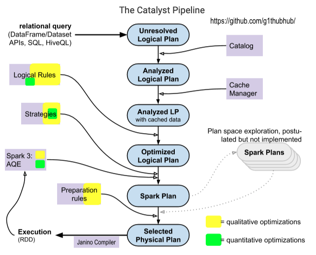

Made in London by [me](https://www.linkedin.com/in/phil-phil-439513182/)

First published [here](https://www.unraveldata.com/resources/catalyst-analyst-a-deep-dive-into-sparks-optimizer/)
<br>
# §9 A deep dive into the Catalyst Optimizer

The Catalyst optimizer is a crucial component of Apache Spark. It optimizes structural queries – expressed in SQL, or via the DataFrame/Dataset APIs – which can reduce the runtime of programs and save costs. Developers often treat Catalyst as a black box that just magically works. Moreover, only a handful of resources are available that explain its inner workings in an accessible manner. 

## The Catalyst Pipeline

<br>
When discussing Catalyst, many presentations and articles reference [this](https://databricks.com/glossary/catalyst-optimizer) architecture diagram, which was included in the [original](https://databricks.com/blog/2015/04/13/deep-dive-into-spark-sqls-catalyst-optimizer.html) blog post from Databricks that introduced Catalyst to a wider audience. The diagram has inadequately depicted the physical planning phase, and there is an ambiguity about what kind of optimizations are applied at which point. 

<br>
The following sections explain Catalyst’s logic, the optimizations it performs, its most crucial constructs, and the plans it generates. In particular, the scope of cost-based optimizations is outlined. These were advertised as “state-of-art” when the framework was [introduced](https://databricks.com/blog/2017/08/31/cost-based-optimizer-in-apache-spark-2-2.html), but this article will describe larger limitations. And, last but not least, I have redrawn the architecture diagram:



Diagram 1: The Catalyst pipeline

<br><br>
The input to Catalyst is a SQL/HiveQL query or a DataFrame/Dataset object which invokes an action to initiate the computation. This starting point is shown in the top left corner of the diagram. The relational query is converted into a high-level plan, against which many transformations are applied. The plan becomes better-optimized and is filled with physical execution information as it passes through the pipeline. The output consists of an execution plan that forms the basis for the RDD graph that is then scheduled for execution.

## Nodes and Trees
Six different plan types are represented in the Catalyst pipeline diagram. They are implemented as Scala trees that descend from [TreeNode](https://github.com/apache/spark/blob/2b147c4cd50da32fe2b4167f97c8142102a0510d/sql/catalyst/src/main/scala/org/apache/spark/sql/catalyst/trees/TreeNode.scala#L81). This abstract top-level class declares a `children` field of type `Seq[BaseType]`. A _TreeNode_ can therefore have zero or more child nodes that are also TreeNodes in turn. In addition, multiple higher-order functions, such as `transformDown`, are defined, which are heavily used by Catalyst’s transformations. 

This functional design allows optimizations to be expressed in an elegant and type-safe fashion; an example is provided below. Many Catalyst constructs inherit from _TreeNode_ or operate on its descendants. Two important abstract classes that were inspired by the logical and physical plans found in databases are [LogicalPlan](https://github.com/apache/spark/blob/2b147c4cd50da32fe2b4167f97c8142102a0510d/sql/catalyst/src/main/scala/org/apache/spark/sql/catalyst/plans/logical/LogicalPlan.scala#L29) and [SparkPlan](https://github.com/apache/spark/blob/2b147c4cd50da32fe2b4167f97c8142102a0510d/sql/core/src/main/scala/org/apache/spark/sql/execution/SparkPlan.scala#L58). Both are of type _QueryPlan_, which is a direct subclass of _TreeNode_. 

In the Catalyst pipeline diagram, the first four plans from the top are LogicalPlans, while the bottom two – _Spark Plan_ and _Selected Physical Plan_ – are SparkPlans. The nodes of logical plans are algebraic operators like _Join_; the nodes of physical plans (i.e. SparkPlans) correspond to low-level operators like _ShuffledHashJoinExec_ or _SortMergeJoinExec_. The leaf nodes read data from sources such as files on stable storage or in-memory lists. The tree root represents the computation result.

## Transformations
An example of Catalyst’s trees and transformation patterns is provided below. We have used expressions to avoid verbosity in the code. Catalyst expressions derive new values and are also trees. They can be connected to logical and physical nodes; an example would be the condition of a filter operator. 

The following snippet transforms the arithmetic expression `–((11 – 2) * (9 – 5))` into `- ((1 + 0) + (1 + 5))`:
``` scala
import org.apache.spark.sql.catalyst.expressions._
val firstExpr: Expression = UnaryMinus(Multiply(Subtract(Literal(11), Literal(2)), Subtract(Literal(9), Literal(5))))
val transformed: Expression = firstExpr transformDown {
   case BinaryOperator(l, r) => Add(l, r)
   case IntegerLiteral(i) if i > 5 => Literal(1)
   case IntegerLiteral(i) if i < 5 => Literal(0)
}
```

The root node of the Catalyst tree referenced by `firstExpr` has the type `UnaryMinus` and points to a single child, `Multiply`. This node has two children, both of type `Subtract`. 

The first `Subtract` node has two `Literal` child nodes that wrap the integer values 11 and 2, respectively, and are leaf nodes. `firstExpr` is refactored by calling the predefined higher-order function `transformDown` with custom transformation logic: The curly braces enclose a function with three pattern matches. They convert all binary operators, such as multiplication, into addition; they also map all numbers that are greater than 5 to 1, and those that are smaller than 5 to zero. 

Notably, the rule in the example gets successfully applied to `firstExpr` without covering all of its nodes: `UnaryMinus` is not a binary operator (having a single child) and 5 is not accounted for by the last two pattern matches. The parameter type of [transformDown](https://github.com/apache/spark/blob/2b147c4cd50da32fe2b4167f97c8142102a0510d/sql/catalyst/src/main/scala/org/apache/spark/sql/catalyst/trees/TreeNode.scala#L307) is responsible for this positive behavior: It expects a partial function which might only cover subtrees (or not match any node) and returns “a copy of this node where `rule` has been recursively applied to it and all of its children (pre-order)”. 

This example appears simple, but the functional techniques are powerful. At the other end of the complexity scale, for example, is a logical rule that, when it fires, applies a dynamic programming [algorithm](https://github.com/apache/spark/blob/2b147c4cd50da32fe2b4167f97c8142102a0510d/sql/catalyst/src/main/scala/org/apache/spark/sql/catalyst/optimizer/CostBasedJoinReorder.scala#L143) to refactor a join.

## Catalyst Plans
The following (intentionally bad) code snippet will be the basis for describing the Catalyst plans in the next sections:
``` scala
val result = session.read.option("header", "true").csv(outputLoc)
   .select("letter", "index")
   .filter($"index" < 10) 
   .filter(!$"letter".isin("h") && $"index" > 6)
result.show()
```

The complete program can be found [here](https://github.com/philunravel/opensource-unravel/blob/master/src/main/scala/com/unraveldata/spark/catalyst/MainProgram.scala). Some plans that Catalyst generates when evaluating this snippet are presented in a textual format below; they should be read from the bottom up. A trick needs to be applied when using pythonic DataFrames, as their plans are hidden; this is described in our upcoming follow-up article, which also features a general interpretation guide for these plans.

## Parsing and Analyzing
The user query is first transformed into a parse tree called **Unresolved** or **Parsed Logical Plan**:
```
'Filter (NOT 'letter IN (h) && ('index > 6))
+- Filter (cast(index#28 as int) < 10)
   +- Project [letter#26, index#28]
             +- Relation[letter#26,letterUppercase#27,index#28] csv
```

This initial plan is then analyzed, which involves tasks such as checking the syntactic correctness, or resolving attribute references like names for columns and tables, which results in an **Analyzed Logical Plan**.

<br>
In the next step, a [cache manager](https://github.com/apache/spark/blob/14211a19f53bd0f413396582c8970e3e0a74281d/sql/core/src/main/scala/org/apache/spark/sql/execution/CacheManager.scala#L216) is consulted. If a previous query was persisted, and if it matches segments in the current plan, then the respective segment is replaced with the cached result. Nothing is persisted in our example, so the _Analyzed Logical Plan_ will not be affected by the cache lookup. 

A textual representation of both plans is included below: 
```
Filter (NOT letter#26 IN (h) && (cast(index#28 as int) > 6))
+- Filter (cast(index#28 as int) < 10)
   +- Project [letter#26, index#28]
            +- Relation[letter#26,letterUppercase#27,index#28] csv
```

Up to this point, the operator order of the logical plan reflects the transformation sequence in the source program, if the former is interpreted from the bottom up and the latter is read, as usual, from the top down. A `read`, corresponding to `Relation`, is followed by a `select` (mapped to `Project`) and two `filter`s. The next phase can change the topology of the logical plan.

## Logical Optimizations
Catalyst applies logical optimization rules to the Analyzed Logical Plan with cache data. They are part of rule groups which are internally called batches. There are 25 batches with 109 rules in total in the [Optimizer](https://github.com/apache/spark/blob/v2.4.7/sql/catalyst/src/main/scala/org/apache/spark/sql/catalyst/optimizer/Optimizer.scala) (Spark 2.4.7). Some rules are present in more than one batch, so the number of distinct logical rules boils down to 69. Most batches are executed once, but some can run repeatedly until the plan converges or a predefined maximum number of iterations is reached. Our [program](https://github.com/philunravel/opensource-unravel/blob/master/src/main/scala/com/unraveldata/spark/catalyst/CollectBatches.scala) _CollectBatches_ can be used to retrieve and print this information, along with a list of all rule batches and individual rules; the output can be found [here](https://github.com/philunravel/opensource-unravel/blob/master/src/main/resources/catalyst_info/optimizer_batches_spark2.tsv).

Major rule categories are operator pushdowns/combinations/replacements and constant foldings. Twelve logical rules will fire in total when Catalyst evaluates our example. Among them are rules from each of the four aforementioned categories: 
- Two applications of `PushDownPredicate` that move the two filters before the column selection
- A `CombineFilters` that fuses the two adjacent filters into one
- An `OptimizeIn` that replaces the lookup in a single-element list with an equality comparison
- A `RewritePredicateSubquery` which rearranges the elements of the conjunctive filter predicate that `CombineFilters` created

These rules reshape the logical plan shown above into the following **Optimized Logical Plan**:
``` 
Project [letter#26, index#28], Statistics(sizeInBytes=162.0 B)
 +- Filter ((((isnotnull(index#28) && isnotnull(letter#26)) && (cast(index#28 as int) < 10)) && NOT (letter#26= h)) && 
  (cast(index#28 as int) > 6)), Statistics(sizeInBytes=230.0 B)
    +- Relation[letter#26,letterUppercase#27,index#28] csv, Statistics(sizeInBytes=230.0 B
```

## Quantitative Optimizations
Spark’s codebase contains a dedicated [Statistics](https://github.com/apache/spark/blob/v2.4.7/sql/catalyst/src/main/scala/org/apache/spark/sql/catalyst/plans/logical/Statistics.scala) class that can hold estimates of various quantities per logical tree node. They include:
- Size of the data that flows through a node
- Number of rows in the table
- Several [column-level](https://github.com/apache/spark/blob/14211a19f53bd0f413396582c8970e3e0a74281d/sql/catalyst/src/main/scala/org/apache/spark/sql/catalyst/plans/logical/Statistics.scala#L98) statistics:
  - Number of distinct values and nulls
  - Minimum and maximum value
  - Average and maximum length of the values
  - An equi-height histogram of the values

Estimates for these quantities are eventually propagated and adjusted throughout the logical plan tree. A `filter` or `aggregate`, for example, can significantly reduce the number of records the planning of a downstream join might benefit from using the modified size, and not the original input size, of the leaf node. 

Two estimation approaches exist: 
- The simpler, **size-only** approach is primarily concerned with the first bullet point, the physical size in bytes. In addition, row count values may be set in a few cases. 
- The **cost-based** approach can compute the column-level dimensions for `Aggregate`, `Filter`, `Join`, and `Project` nodes, and may improve their size and row count values. 

For other node types, the cost-based technique just delegates to the size-only methods. The approach chosen depends on the _spark.sql.cbo.enabled_ property. If you intend to [traverse](https://github.com/apache/spark/blob/14211a19f53bd0f413396582c8970e3e0a74281d/sql/catalyst/src/main/scala/org/apache/spark/sql/catalyst/plans/logical/statsEstimation/LogicalPlanStats.scala#L34) the logical tree with a cost-based estimator, then set this property to _true_. Besides, the table and column statistics should be collected for the advanced dimensions prior to the query execution in Spark. This can be achieved with the [ANALYZE](https://spark.apache.org/docs/latest/sql-ref-syntax-aux-analyze-table.html) command. However, a severe limitation seems to exist for this collection process, according to the [latest](https://spark.apache.org/docs/latest/sql-performance-tuning.html) documentation:
> currently statistics are only supported for Hive Metastore tables where the command ANALYZE TABLE <tableName> COMPUTE STATISTICS noscan has been run

The estimated statistics can be used by two logical rules, namely `CostBasedJoinReorder` and `ReorderJoin` (via `StarSchemaDetection`), and by the `JoinSelection` strategy in the subsequent phase, which is described further below.

## The Cost-Based Optimizer
A fully fledged **Cost-Based Optimizer** (CBO) seems to be a work in progress, as indicated [here](https://github.com/apache/spark/blob/14211a19f53bd0f413396582c8970e3e0a74281d/sql/catalyst/src/main/scala/org/apache/spark/sql/catalyst/optimizer/CostBasedJoinReorder.scala#L138):
> For cost evaluation, since physical costs for operators are not available currently, we use cardinalities and sizes to compute costs
The CBO facilitates the `CostBasedJoinReorder` rule and may improve the quality of estimates; both can lead to better planning of joins. Concerning column-based statistics, only the two count stats (`distinctCount` and `nullCount`) appear to participate in the optimizations; the other advanced stats may improve the estimations of the quantities that are directly used.

<br>
The scope of quantitative optimizations does not seem to have significantly expanded with the introduction of the CBO in Spark 2.2. It is not a separate phase in the Catalyst pipeline, but improves the join logic in several important places. This is reflected in the Catalyst optimizer diagram by the smaller green rectangles, since the stats-based optimizations are outnumbered by the rule-based/heuristic ones.
The CBO will not affect the Catalyst plans in our example for three reasons: 
- The property _spark.sql.cbo.enabled_ is not modified in the source code and defaults to _false_.
- The input consists of raw CSV files for which no table/column statistics were collected.
- The program operates on a single dataset without performing any joins. 

The textual representation of the optimized logical plan shown above includes three `Statistics` segments which only hold values for `sizeInBytes`. This further indicates that size-only estimations were used exclusively; otherwise `attributeStats` fields with multiple advanced stats would appear.

## Physical Planning
The optimized logical plan is handed over to the query planner ([SparkPlanner](https://github.com/apache/spark/blob/v2.4.7/sql/core/src/main/scala/org/apache/spark/sql/execution/SparkPlanner.scala)), which refactors it into a _SparkPlan_ with the help of strategies — [Spark strategies](https://github.com/apache/spark/blob/14211a19f53bd0f413396582c8970e3e0a74281d/sql/core/src/main/scala/org/apache/spark/sql/execution/SparkStrategies.scala#L48) are matched against logical plan nodes and map them to physical counterparts if their constraints are satisfied. After trying to apply all strategies (possibly in several iterations), the `SparkPlanner` returns a list of valid physical plans with at least one member. 

Most strategy clauses replace one logical operator with one physical counterpart and insert `PlanLater` placeholders for logical subtrees that do not get planned by the strategy. These placeholders are transformed into physical trees later on by reapplying the strategy list on all subtrees that contain them. 

As of Spark 2.4.7, the query planner applies ten distinct strategies (six more for streams). These strategies can be retrieved with our [CollectStrategies](https://github.com/philunravel/opensource-unravel/blob/master/src/main/scala/com/unraveldata/spark/catalyst/CollectStrategies.scala) program. Their scope includes the following items:
- The push-down of filters to, and pruning of, columns in the data source 
- The planning of scans on partitioned/bucketed input files 
- The aggregation strategy (`SortAggregate`, `HashAggregate`, or `ObjectHashAggregate`) 
- The choice of the join algorithm (_broadcast hash_, _shuffle hash_, _sort merge_, _broadcast nested loop_, or _cartesian product_)

<br>
The SparkPlan of the running example has the following shape:
```
Project [letter#26, index#28]
+- Filter ((((isnotnull(index#28) && isnotnull(letter#26)) && (cast(index#28 as int)<10)) && NOT (letter#26=h)) && (cast(index#28 as int)>6))
   +- FileScan csv [letter#26,index#28] Batched: false, Format: CSV, Location: InMemoryFileIndex[file:/example], PartitionFilters: [],
   PushedFilters: [IsNotNull(index), IsNotNull(letter), Not(EqualTo(letter,h))], ReadSchema: struct<letter:string,index:string>
```

A `DataSource` strategy was responsible for planning the `FileScan` leaf node and we see multiple entries in its `PushedFilters` field. Pushing filter predicates down to the underlying source can avoid scans of the entire dataset if the source knows how to apply them; the pushed `IsNotNull` and `Not(EqualTo)` predicates will have a small or nil effect, since the program reads from CSV files and only one cell with the letter _h_ exists.

<br>
The original architecture diagram [depicts](https://databricks.com/wp-content/uploads/2015/04/Screen-Shot-2015-04-12-at-8.41.26-AM.png) a **Cost Model** that is supposed to choose the SparkPlan with the lowest execution cost. However, such plan space explorations are still not realized in Spark 3.01; the [code](https://github.com/apache/spark/blob/2b147c4cd50da32fe2b4167f97c8142102a0510d/sql/core/src/main/scala/org/apache/spark/sql/execution/QueryExecution.scala#L330) trivially picks the first available SparkPlan that the query planner returns after applying the strategies. 

A simple, “localized” cost model might be implicitly defined in the codebase by the order in which rules and strategies and their internal logic get applied. For example, the `JoinSelection` strategy assigns the highest precedence to the broadcast hash join. This tends to be the best join algorithm in Spark when one of the participating datasets is small enough to fit into memory. If its conditions are met, the logical node is immediately mapped to a `BroadcastHashJoinExec` physical node, and the plan is returned. Alternative plans with other join nodes are not generated.

## Physical Preparation
The Catalyst pipeline concludes by transforming the Spark Plan into the Physical/Executed Plan with the help of preparation rules. These [rules](https://github.com/apache/spark/blob/14211a19f53bd0f413396582c8970e3e0a74281d/sql/core/src/main/scala/org/apache/spark/sql/execution/QueryExecution.scala#L98) can affect the number of physical operators present in the plan. For example, they may insert shuffle operators where necessary (`EnsureRequirements`), deduplicate existing `Exchange` operators where appropriate (`ReuseExchange`), and merge several physical operators where possible (`CollapseCodegenStages`).

The final plan for our example has the following format:
```
(1) Project [letter#26, index#28]
+- *(1)Filter((((isnotnull(index#28) && isnotnull(letter#26)) && (cast(index#28 as int)<10)) && NOT(letter#26=h)) && (cast(index#28 as int)>6))
   +- *(1) FileScan csv [letter#26,index#28] Batched: false, Format: CSV, Location: InMemoryFileIndex[file:/example], PartitionFilters: [],
    PushedFilters: [IsNotNull(index), IsNotNull(letter), Not(EqualTo(letter,h))], ReadSchema: struct<letter:string,index:string>

``` 

This textual representation of the Physical Plan is identical to the preceding one for the Spark Plan, with one exception: Each physical operator is now prefixed with a `*(1)`. The asterisk indicates that the aforementioned `CollapseCodegenStages` preparation rule, [which](https://github.com/apache/spark/blob/14211a19f53bd0f413396582c8970e3e0a74281d/sql/core/src/main/scala/org/apache/spark/sql/execution/WholeStageCodegenExec.scala#L491) "compiles a subtree of plans that support codegen together into a single Java function," fired.

The number after the asterisk is a counter for the CodeGen stage index. This means that Catalyst has compiled the three physical operators in our example together into the body of one Java function. This comprises the first and only `WholeStageCodegen` stage, which in turn will be executed in the first and only Spark stage. The code for the collapsed stage will be generated by the [Janino](https://janino-compiler.github.io/janino/#links) compiler at run-time.

## Adaptive Query Execution in Spark 3
One of the major enhancements introduced in Spark 3.0 is **Adaptive Query Execution** (AQE), a framework that can improve query plans during run-time. Instead of passing the entire physical plan to the scheduler for execution, Catalyst tries to slice it up into subtrees ("[query stages](https://github.com/apache/spark/blob/2b147c4cd50da32fe2b4167f97c8142102a0510d/sql/core/src/main/scala/org/apache/spark/sql/execution/adaptive/AdaptiveSparkPlanExec.scala#L123)") that can be executed in an incremental fashion. 

The adaptive logic begins at the bottom of the physical plan, with the stage(s) containing the leaf nodes. Upon completion of a query stage, its run-time data statistics are used for reoptimizing and replanning its parent stages. The scope of this new framework is limited: The [official](https://spark.apache.org/docs/latest/sql-performance-tuning.html) SQL guide states that "there are three major features in AQE, including coalescing post-shuffle partitions, converting sort-merge join to broadcast join, and skew join optimization." A query must not be a streaming query and its plan [must](https://github.com/apache/spark/blob/2b147c4cd50da32fe2b4167f97c8142102a0510d/sql/core/src/main/scala/org/apache/spark/sql/execution/adaptive/InsertAdaptiveSparkPlan.scala#L79) contain at least one Exchange node (induced by a join for example) or a subquery; otherwise, an adaptive execution will not be even attempted – if a query satisfies the requirements, it may not get improved by AQE.

<br>
A large part of the adaptive logic is implemented in a special physical root node called [AdaptiveSparkPlanExec](https://github.com/apache/spark/blob/v3.0.1/sql/core/src/main/scala/org/apache/spark/sql/execution/adaptive/AdaptiveSparkPlanExec.scala). Its method `getFinalPhysicalPlan` is used to traverse the plan tree recursively while creating and launching query stages. The SparkPlan that was derived by the preceding phases is divided into smaller segments at `Exchange` nodes (i.e., shuffle boundaries), and query stages are formed from these subtrees. When these stages complete, fresh run-time stats become available, and can be used for reoptimization purposes.

A [dedicated](https://github.com/apache/spark/blob/2b147c4cd50da32fe2b4167f97c8142102a0510d/sql/core/src/main/scala/org/apache/spark/sql/execution/adaptive/AdaptiveSparkPlanExec.scala#L79), slimmed-down logical optimizer with just one rule, `DemoteBroadcastHashJoin`, is applied to the logical plan associated with the current physical one. This special rule attempts to prevent the planner from converting a sort merge join into a broadcast hash join if it detects a high ratio of empty partitions. In this specific scenario, the first join type will likely be more performant, so a _no-broadcast-hash-join_ hint is inserted. 

The new optimized logical plan is fed into the default query planner (SparkPlanner) which applies its strategies and returns a SparkPlan. Finally, a [small](https://github.com/apache/spark/blob/2b147c4cd50da32fe2b4167f97c8142102a0510d/sql/core/src/main/scala/org/apache/spark/sql/execution/adaptive/AdaptiveSparkPlanExec.scala#L91) number of physical operator rules are applied that takes care of the subqueries and missing ShuffleExchangeExecs. This results in a refactored physical plan, which is then compared to the original version. The physical plan with the lowest number of shuffle exchanges is considered cheaper for execution and is therefore chosen. 

When query stages are created from the plan, four adaptive physical rules are [applied](https://github.com/apache/spark/blob/2b147c4cd50da32fe2b4167f97c8142102a0510d/sql/core/src/main/scala/org/apache/spark/sql/execution/adaptive/AdaptiveSparkPlanExec.scala#L97) that include `CoalesceShufflePartitions`, `OptimizeSkewedJoin`, and `OptimizeLocalShuffleReader`. The logic of AQE’s major new optimizations is implemented in these case classes. Databricks explains these in more detail [here](https://databricks.com/blog/2020/05/29/adaptive-query-execution-speeding-up-spark-sql-at-runtime.html). A [second](https://github.com/apache/spark/blob/2b147c4cd50da32fe2b4167f97c8142102a0510d/sql/core/src/main/scala/org/apache/spark/sql/execution/adaptive/AdaptiveSparkPlanExec.scala#L108) list of dedicated physical optimizer rules is applied right after the creation of a query stage; these mostly make internal adjustments.

<br>
The last paragraph has mentioned four adaptive optimizations which are implemented in one logical rule (`DemoteBroadcastHashJoin`) and three physical ones (`CoalesceShufflePartitions`, `OptimizeSkewedJoin`, and `OptimizeLocalShuffleReader`). All four make use of a special [statistics](https://github.com/apache/spark/blob/v3.0.1/core/src/main/scala/org/apache/spark/MapOutputStatistics.scala) class that holds the output size of each map output partition. The statistics mentioned in the _Quantitative Optimization_ section above do get refreshed, but will not be leveraged by the standard logical rule batches, as a custom logical optimizer is used by AQE.

<br>
This article has described Spark’s Catalyst optimizer in detail. Developers who are unhappy with its default behavior can [add](https://issues.apache.org/jira/browse/SPARK-18127) their own logical optimizations and strategies or [exclude](https://github.com/apache/spark/blob/2b147c4cd50da32fe2b4167f97c8142102a0510d/sql/catalyst/src/main/scala/org/apache/spark/sql/internal/SQLConf.scala#L184) specific logical optimizations. However, it can become complicated and time-consuming to devise customized logic for query patterns and other factors, such as the choice of machine types, may also have a significant impact on the performance of applications.