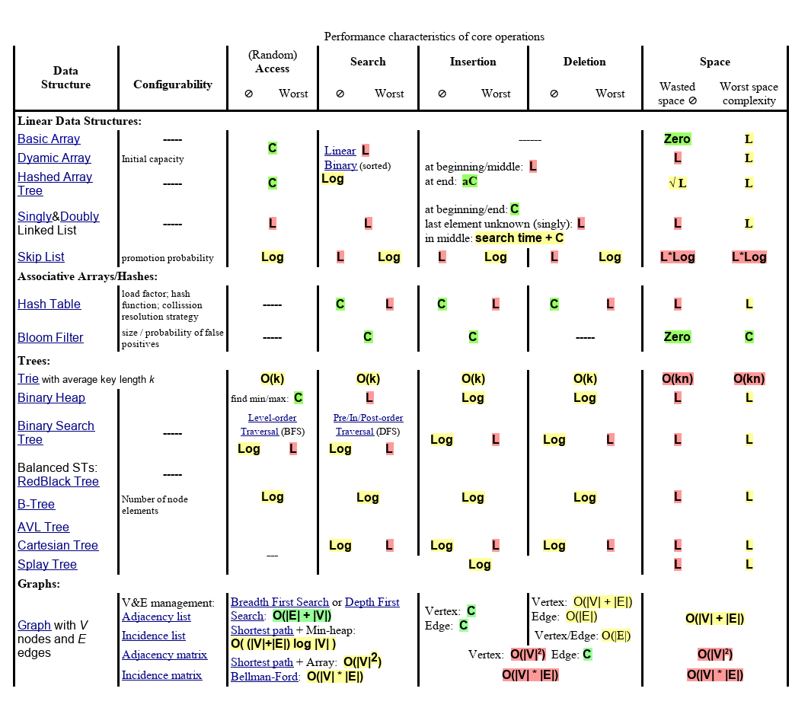
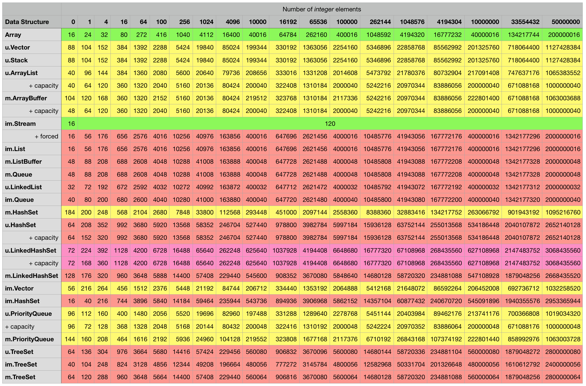
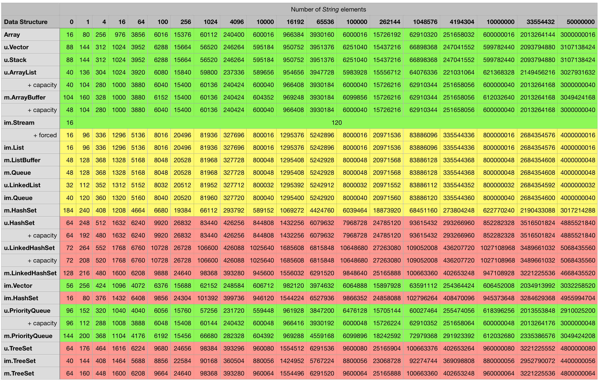
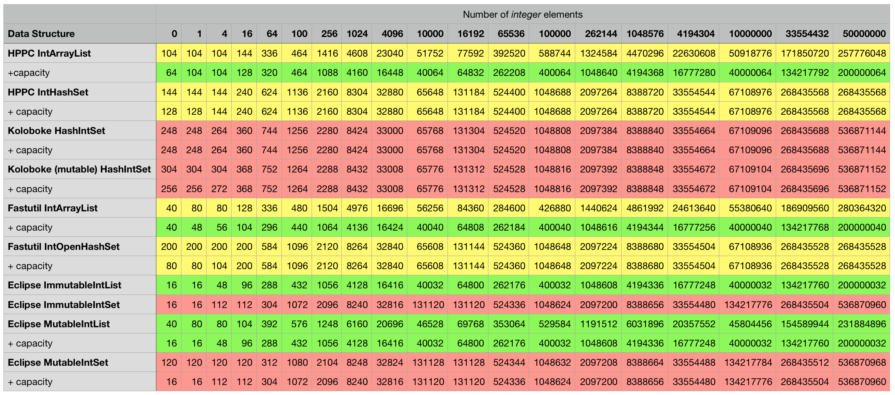
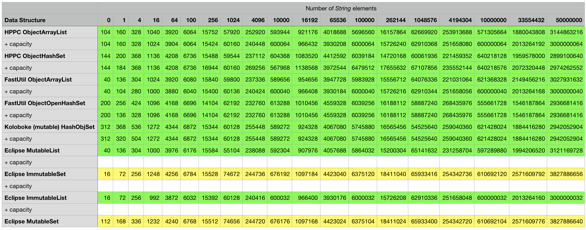
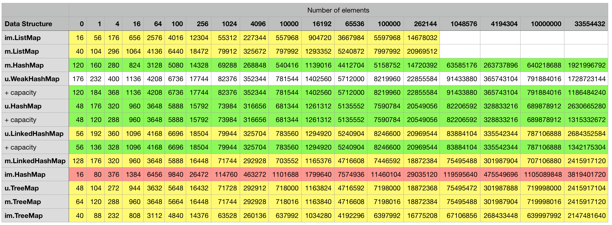
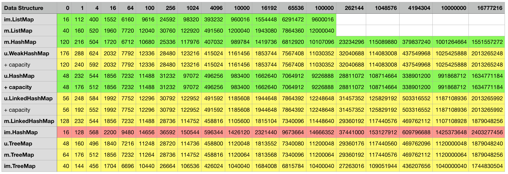
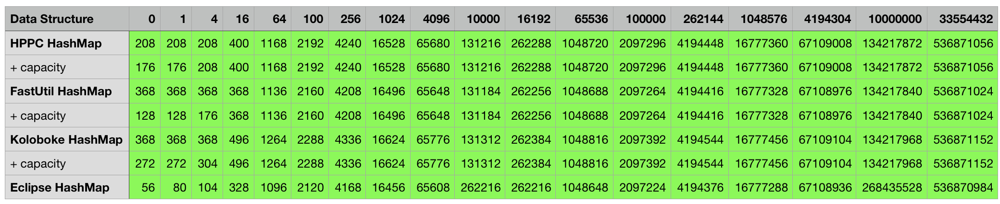
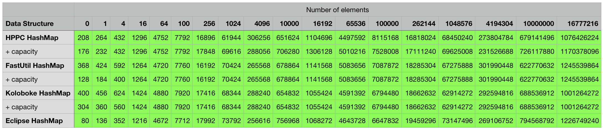

# Phil's Data Structure Zoo

Solving a problem programatically often involves grouping data items together so they can be conveniently operated on or copied as a single unit -- the items are collected in a **data structure**. Many different data structures have been designed over the past decades, some store **individual** items like phone numbers, others store more complex objects like name/phone number **pairs**. Each has strengths and weaknesses and is more or less suitable for a specific use case. In this article, I will describe and attempt to classify some of the most popular data structures and their actual implementations on three different abstaction levels starting from a Platonic ideal and ending with actual code that is benchmarked:  


- Theoretical level: Data structures/collection types are described irrespective of any concrete implementation and the asymptotic behaviour of their core operations are listed.
- Implementation level: It will be shown how the container classes of a specific programming language relate to the data structures introduced at the previous level -- e.g., despite their name similarity, [Java's _Vector_](https://docs.oracle.com/javase/8/docs/api/java/util/Vector.html) is different from [Scala's](https://www.scala-lang.org/api/current/scala/collection/immutable/Vector.html) or [Clojure's](http://clojuredocs.org/clojure.core/vector) _Vector_ implementation. In addition, asymptotic complexities of core operations will be provided per implementing class.
- Empirical level: Two aspects of the efficiency of data structures will be measured: The memory footprints of the container classes will be determined under different configurations. The runtime performance of operations will be measured which will show to that extend asymptotic advantages manifest themselves in concrete scenarios and what the relative performances of asymptotically equal structures are.

* * * 

## Theoretical Level
Before providing actual speed and space measurement results in the third section, execution time and space can be described in an abstract way as a function of the number of items that a data structure might store. This is traditionally done via [Big O notation](https://en.wikipedia.org/wiki/Big_O_notation) and the following abbrevations are used throughout the tables:
- **C** is constant time, O(1)
- **aC** is [amortized](https://en.wikipedia.org/wiki/Amortized_analysis) constant time
- **eC** is effective constant time
- **Log** is logarithmic time, O(log n)
- **L** is linear time, O(n)

The green, yellow or red background colours in the table cells will indicate how "good" the time complexity of a particular data structure/operation combination is relative to the other combinations. 
<br/><br/>
Table 1
 


The first five entries of Table 1 are **linear** data structures: They have a linear ordering and can only be traversed in one way. By contrast, **Trees** can be traversed in different ways, they consist of hierarchically linked data items that each have a single parent except for the root item. Trees can also be classified as connected **graphs** without cycles; a data item (= _node_ or _vertex_) can be connected to more than two other items in a graph. 
<br/><br/>
Data structures provide many operations for manipulating their elements. The most important ones are the following four core operations which are included above and studied throughout this article:
- **Access**: Read an element located at a certain position 
- **Search**: Search for a certain element in the whole structure
- **Insertion**: Add an element to the structure
- **Deletion**: Remove a certain element
<br/><br/>

Table 1 includes two **probabilistic** data structures, _Bloom Filter_ and _Skip List_.

* * *

## Implementation Level -- Java & Scala Collections Framework

The following table classifies almost all members of both the official
[Java Collection](https://docs.oracle.com/javase/tutorial/collections/) and [Scala Collection](https://docs.scala-lang.org/overviews/core/architecture-of-scala-collections.html) libraries in addition to a number of relevant classes like _Array_ or _String_ that are not canonical members.
The actual class names are placed in the second column, a name that starts with _im._ or _m._ refers to a Scala class, other prefixes refer to Java classes. The fully qualified class names are shortened by using the following abbreviations:
- _u._ stands for the package _java.util_
- _c._ stands for the package _java.util.concurrent_
- _lang._ stands for the package _java.lang_
- _m._ stands for the package _scala.collection.mutable_
- _im._ stands for the package _scala.collection.immutable_

<br/><br/>
The actual **method names** and logic of the four core operations (_Access_, _Search_, _Addition_ and _Deletion_) are dependent on a concrete implementation. In the table below, these method names are printed right before the asymptotic times in _italic_ (they will also be used in the core operation benchmarks later). For example: Row number eleven describes the implementation _u.ArrayList_ (second column) which refers to the Java collection class `java.util.ArrayList`. In order to access an item in a particular position (fourth column, _Random Access_), the method `get` can be called on an object of the ArrayList class with an integer argument that indicates the position. A particular element can be searched for with the method `indexOf` and an item can be added or deleted via `add` or `remove`.
Scala's closest equivalent is the class `scala.collection.mutable.ArrayBuffer` which is described two rows below _ArrayList_: To retrieve the element in the third position from an ArrayBuffer, Scala's `apply` method can be used which allows an object to be used in function notation, Ss we would write `val thirdElement = bufferObject(2)`. Searching for an item can be done via `find` and appending or removing an element from an ArrayBuffer is possible by calling the methods `+=` and `-=` respectively.

<br/><br/>
Table2
 
Table2
<br/><br/>

**Subclass** and **wrapping** relationships between two classes are represented via `<e)` and `<w)`. For example, the class `java.util.Stack` extends `java.util.Vector` and the Scala class `scala.collection.mutable.StringBuilder` wraps the Java class `java.lang.StringBuilder` in order to provide idiomatic functions and additional operations.

### General features of Java & Scala structures

Several collection properties are not explicitly represented in the table above since they either apply to almost all elements or a simple rule exists: 

Almost all data structures that store **key/value pairs** have the characters `Map` as part of their class name in the second column. The sole exception to this naming convention is `java.util.Hashtable` which is a retrofitted legacy class born before Java 2 that also stores key/value pairs.
<br/><br/>
Almost all Java Collections are **mutable**: They can be destroyed, elements can be removed from or added to them and their data values can be modified in-place, mutable structures can therefore loose their original/previous state. By contrast, Scala provides a dedicated **immutable** package (_scala.collection.immutable_) whose members, in contrast to _scala.collection.mutable_ and the Java collections, cannot be changed in-place.  All members of this immutable package are also **persistent**: Modifications will produce an updated version via structural sharing and/or path copying while also preserving the original version.  Examples of immutable but **non-persistent** data structures from third party providers are mentioned below. 
<br/><br/>
Mutability can lead to problems when **concurrency** comes into play. Most classes in Table 2 that do not have the prefix _c._ (abbreviating the package `java.util.concurrent`) are **unsynchronized**. In fact, one of the design decision made in the _Java Collections Framework_ was to not synchronize most members of the `java.util` package since single-threaded or read-only uses of data structures are pervasive. In case synchronization for these classes is required, `java.util.Collections` provides a cascade of `synchronized*` methods that accept a given collection and return a synchronized, thread-safe version.

Due to the nature of immutability, the (always unsynchronized) immutable structures in Table 2 are thread-safe.
<br/><br/>
All entries in Table 2 are **eager** except for `scala.collection.immutable.Stream` which is a **lazy** list that only computes elements that are accessed.
<br/><br/>
Java supports the eight **primitive** data types _byte_, _short_, _int_, _long_, _float_, _double_, _boolean_ and _char_. Things are a bit more complicated with Scala but the same effectively also applies there at the bytecode level. Both languages provide primitive and object arrays but the Java and Scala Collection libraries are **object collection**s which always store object references: When primitives like _3_ or _2.3F_ are inserted, the values get autoboxed so the respective collections will hold a reference to numeric objects (a wrapper class like _java.lang.Integer_) and not the primitive values themselves:
```java
        int[] javaArrayPrimitive = new int[]{1, 2, 3, 4, 5, 6, 7, 8, 9, 10, 11};
        Integer[] javaArrayObject = new Integer[]{1, 2, 3, 4, 5, 6, 7, 8, 9, 10, 11};
        // javaArrayPrimitive occupies just 64 Bytes, javaArrayObject 240 Bytes

        List<Integer> javaList1 = new ArrayList<>(11); // initial capacity of 11
        List<Integer> javaList2 = new ArrayList<>(11);
        for (int i : javaArrayPrimitive)
            javaList1.add(i);
        for (int i : javaArrayObject)
            javaList2.add(i);
        // javaList1 is 264 bytes in size now as is javaList2
```
Similar results for Scala:
```scala
  val scalaArrayPrimitive = Array[Int](1, 2, 3, 4, 5, 6, 7, 8, 9, 10, 11)
  val scalaArrayObject = scalaArrayPrimitive.map(new java.lang.Integer(_))
  // scalaArrayPrimitive occupies just 64 Bytes, scalaArrayObject 240 Bytes

  val scalaBuffer1 = scalaArrayPrimitive.toBuffer
  val scalaBuffer2 = scalaArrayObject.toBuffer
  // scalaBuffer1 is 264 bytes in size now as is scalaBuffer2
```


Several third party libraries provide **primitive collection** support on the JVM allowing the 8 primitives mentioned above to be directly stored in data structures. This can have a big impact on the memory footprint -- the creators of Apache Spark recommend in their official [tuning guide](http://spark.apache.org/docs/latest/tuning.html) to

> Design your data structures to prefer arrays of objects, and primitive types, instead of the standard Java or Scala collection classes (e.g. HashMap). The fastutil library provides convenient collection classes for primitive types that are compatible with the Java standard library.

We will see below whether _FastUtil_ is really the most suitable alternative.

* * *
## Empirical Level
Hardly any concrete memory sizes and runtime numbers have been mentioned so far, these two measurements are in fact very different: Estimating memory usage is a deterministic task compared to runtime performance since the latter might be influenced by several non-deterministic factors, especially when operations run on an adaptive virtual machine that performans online optimizations.

### Memory measurements for JVM objects
Determining the memory footprint of a complex object is far from trivial since JVM languages don't provide a direct API for that purpose. Apache Spark has an internal function for this purpose that implements the suggestions of an older JavaWorld [article](http://www.javaworld.com/javaworld/javaqa/2003-12/02-qa-1226-sizeof.html). I ported the code and modified it a bit [here](https://github.com/g1thubhub/datastructurezoo/blob/master/src/main/scala/memmeasure/spark/JvmSizeEstimator.scala) so this memory measuring functionality can be conveniently used outside of Spark:
```scala
  val objectSize = JvmSizeEstimator.estimate(new Object())
  println(objectSize) // will print 16 since one flat object instance occupies 16 bytes
```
Measurements for the most important classes from Table 2 with different element types and element sizes are shown below. The **number of elements** will be _0, 1, 4, 16, 64, 100, 256, 1024, 4096, 10000, 16192, 65536, 100000, 262144, 1048576, 4194304, 10000000, 33554432_ and _50000000_ in all configurations. For data structures that store individual elements, the two **element types** are _int_ and _String_. For structures operating with key/value pairs, the combinations _int/int_ and _float/String_ will be used. The raw sizes of these element types are 4 bytes in the case of an individual _int_ or _float_ (16 bytes in boxed form) and, since all Strings used here will be 8 characters long, 56 bytes per _String_ object. 
<br/><br/>
The same package abbreviations as in Table 2 above will be used for the Java/Scala classes under measurement. In addition, some classes from the following 3rd party libraries are also used in their latest edition at the time of writing:
- [HPPC](https://labs.carrotsearch.com/hppc.html) (0.8.1)
- [Koloboke](https://koloboke.com/) (1.0.0)
- [fastutil](http://fastutil.di.unimi.it/) (8.2.1)
- [Eclipse Collections](https://www.eclipse.org/collections/) (9.2.0)
<br/><br/>

Concerning the environment, _jdk1.8.0_171.jdk_ on _MacOS High Sierra 10.13_ was used. The JVM flag `+UseCompressedOops` can affect object memory sizes and was enabled here, it is enabled by default in Java 8. 

<br/><br/>
#### Measurements of single element structures
Below are the measurement results for the various combinations, every cell contains the object size in bytes for the particular data structure in the corresponding row filled with the number of elements indicated in the column. Some mutable classes provide the option to specify an **initial capacity** at construction time which can sometimes lead to a smaller overall object footprint after the structure is filled up. I included an additional _+ capacity_ row in cases where data structure in the previous row provides such an option and a difference could be measured.
<br/><br/>
**Java/Scala structures storing integers**:
 
<br/><br/>
**Java/Scala structures storing strings**:
 
<br/><br/>
**3rd party structures storing integers**:
 
<br/><br/>
**3rd party structures storing strings**:
 
<br/><br/>

#### Measurements for key/value structures
For some mutable key/value structures like Java's _HashMap_, a **load factor** that determines when to rehash can be specified in addition to an initial capacity. Similar to the logic in the previous tables, a row with + _capacity_ will indicate that the data structure from the previous row was initialized using a capacity.  

**Java/Scala structures storing integer/integer pairs**:
 
<br/><br/>
**Java/Scala structures storing strings/float pairs**:
 
<br/><br/>
**3rd party structures storing integer/integer pairs**:
 
<br/><br/>
**3rd party structures storing strings/float pairs**:
 
<br/><br/>


* * *

### Operation benchmarking
| Under construction |


