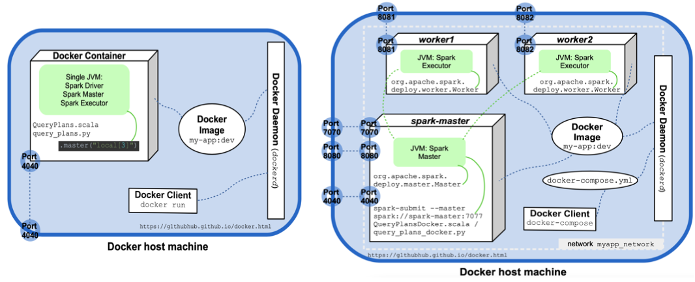
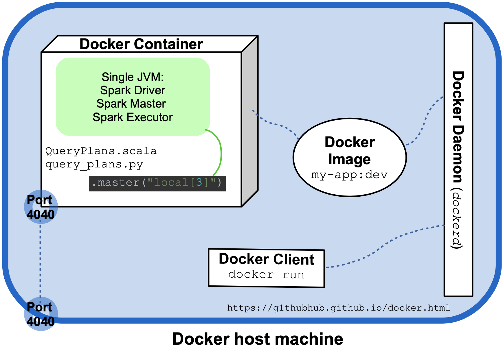
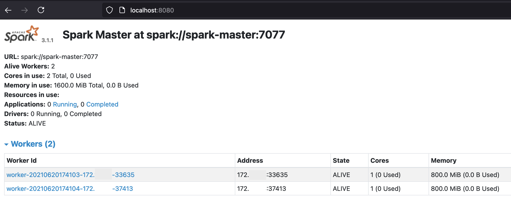
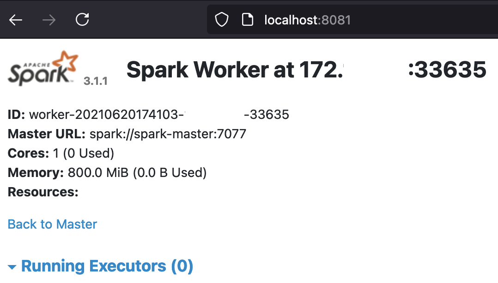
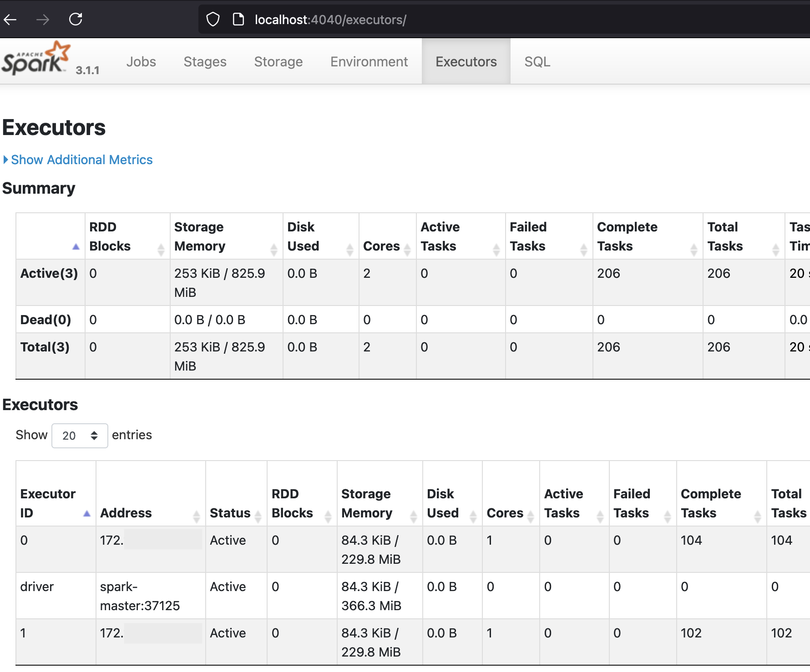
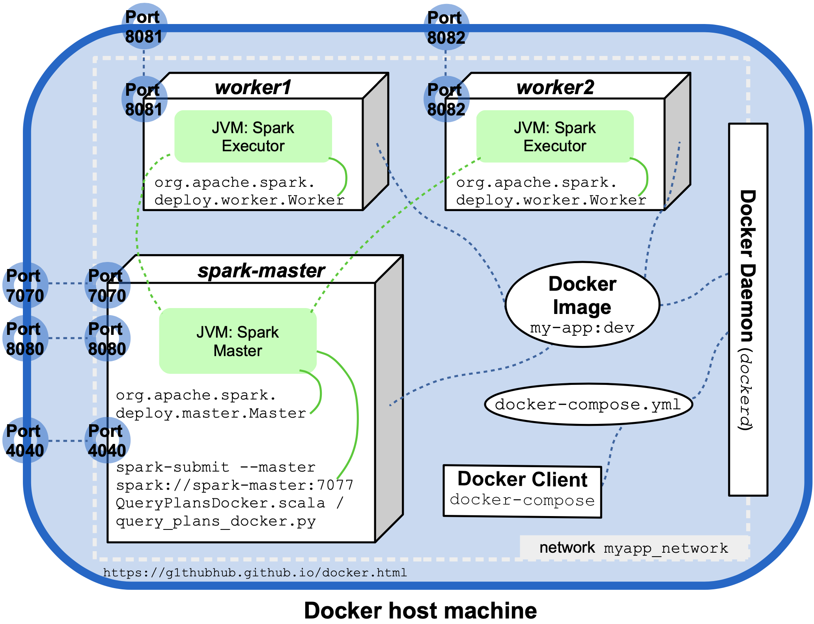

Made in London by [me](https://www.linkedin.com/in/phil-phil-439513182/) <br>
Back to the [index](https://g1thubhub.github.io/index.html) <br>

<br>


# §1 Apache Spark and Docker 

<br>
One of the major recent additions to Apache Spark has been the [full](https://issues.apache.org/jira/browse/SPARK-33005) support for Kubernetes. When **Kubernetes** is chosen as cluster manager, users must submit apps that are containerized. Several container formats are supported by Kubernetes but Docker is the most popular option. This article describes how a bilingual [codebase](https://github.com/g1thubhub/bdrecipes) containing Python and Scala sources mixed with third party dependencies can be containerized and run as a Docker app: At first, the programs are executed in local mode in a single Docker container. The second part shows how a small cluster can be launched by using Spark's cluster mode in a multi-container Docker app, a sneak peak is pasted below:

<br>


<br>
The practical segments of this article use code from the _bdrecipes_ project, the [preamble](https://g1thubhub.github.io/intro-code.html) descibes how this codebase can be easily set up locally. Alternatively, a full Docker image with all application code and artefacts is available [here](https://hub.docker.com/repository/docker/bdrecipes/spark-on-docker).

## Parent Docker Images
A Docker **image** is a blueprint that can be used by the Docker engine to instantiate containers. According to the official [doc](https://docs.docker.com/get-started/), a **container** is "another process on your machine that has been isolated from all other processes on the host machine". An image definition does not have to start from scratch, but can import an existing image and apply modifications to it. This customization approach will be used here: DataMechanics has recently [published](https://www.datamechanics.co/blog-post/optimized-spark-docker-images-now-available) a fleet of free Docker images. Each of these images contains a Spark distribution and a few additional bells and whistles like Jupyter notebook support or connectors to object stores like S3.

<br>
Dozens of Docker images are [available](https://hub.docker.com/r/datamechanics/spark) so the most suitable one for the dockerization of a given codebase needs to be determined: The _bdrecipes_ [POM file](https://github.com/g1thubhub/bdrecipes/blob/9aaabe42b62a2c12eaa8fa39bddb76bbf056641d/pom.xml#L11) specifies Spark version 3.1.1, Scala 2.12.10 and Java 8. PySpark programs can be found under the [python](https://github.com/g1thubhub/bdrecipes/tree/master/tutorials/module1/python) folder and I'm using Python 3.8.2 locally. In addition to that, I downloaded the Spark distribution `spark-3.1.1-bin-hadoop3.2` from [here](https://spark.apache.org/downloads.html) for local use. The best match for this combination seems to be the Docker image with the annotation [3.1.1-hadoop-3.2.0-java-8-scala-2.12-python-3.8-dm13
](https://hub.docker.com/layers/datamechanics/spark/3.1.1-hadoop-3.2.0-java-8-scala-2.12-python-3.8-dm13/images/sha256-4ec1977ea8bec627a63c4e660b62ccc57c7998fe57a6d035312cad52bc243d55?context=explore) which is what the first entry of the _bdrecipes_ Dockerfile (described later) will specify.

## Derived Docker Images
The next section details the steps involved when deriving a custom image from a parent image like `3.1.1-hadoop-3.2.0-java-8-scala-2.12-python-3.8-dm13`. A shortcut is available for impatient readers who want to skip the necessary installation of _bdrecipes_ and the image build process: The finished custom image was pushed to a docker [repository](https://hub.docker.com/repository/docker/bdrecipes/spark-on-docker) and can be fetched with `docker pull bdrecipes/spark-on-docker`
``` bash
$ docker pull bdrecipes/spark-on-docker
   Using default tag: latest
   latest: Pulling from bdrecipes/spark-on-docker 
[...]
$ docker images 
   REPOSITORY                  TAG       IMAGE ID    CREATED       SIZE
   bdrecipes/spark-on-docker   latest    e6fcd107d   6 hours ago   2.34GB
```

If this prebuilt image is used, the docker commands in the examples below need to be slightly modified: Instead of referring to the image `my-app:dev` which is manually assembled during the next section, examples would use `bdrecipes/spark-on-docker`, e.g., the command `docker run --rm -i -t my-app:dev bash` changes to `docker run --rm -i -t bdrecipes/spark-on-docker bash`. The following section explains how the `bdrecipes/spark-on-docker` image was assembled before it was pushed to the repository:

## The Dockerfile
The first step in the dockerization of a codebase consists in the creation of a **Dockerfile** in the project's root directory. This is a simple text file which contains instructions, the Docker daemon runs this file to assemble an image. The [Dockerfile](https://github.com/g1thubhub/bdrecipes/blob/master/Dockerfile) for _bdrecipes_ consists of these entries:

``` bash
FROM gcr.io/datamechanics/spark:3.1.1-hadoop-3.2.0-java-8-scala-2.12-python-3.8-dm13

COPY tutorials/ tutorials/

COPY resources/ resources/

COPY target/bdrecipes-phil.jar .

COPY scripts/launch_spark_daemon.sh .

COPY requirements.txt .

RUN pip3 install -r requirements.txt

COPY setup.py setup.py

RUN pip3 install -e .
```

The following paragraphs explain the individual instructions in this Dockerfile in more detail. The first line initializes a new build stage and declares the parent image from which our custom image is derived. The previous section has established that the most suitable parent is `spark:3.1.1-hadoop-3.2.0-java-8-scala-2.12-python-3.8-dm13` which results in the following initial instruction:
``` bash
FROM gcr.io/datamechanics/spark:3.0.2-hadoop-3.2.0-java-8-scala-2.12-python-3.8-dm13
```

All Spark programs of the _bdrecipes_ project are placed in the [tutorials](https://github.com/g1thubhub/bdrecipes/tree/master/tutorials) folder while input files reside in the [resources](https://github.com/g1thubhub/bdrecipes/tree/master/resources) folder. Both folders are made avaiable in containers by the next two _copy_ lines in the Dockerfile: 
``` bash
COPY tutorials/ tutorials/
COPY resources/ resources/
```
With these instructions, a local file like `/Users/me/IdeaProjects/bdrecipes/tutorials/module1/python/query_plans.py` will be found under `/opt/spark/work-dir/tutorials/module1/python/query_plans.py` in the container filesystem. Similarly, an input file argument like `/Users/me/IdeaProjects/bdrecipes/resources/warc.sample` would have to be passed as `/opt/spark/work-dir/resources/warc.sample` to a dockerized run of [query_plans.py](https://github.com/g1thubhub/bdrecipes/blob/master/tutorials/module1/python/query_plans.py) as will be demonstrated below.

<br>
Before Scala or Java sources can be executed, a **fat JAR** needs to be assembled via `mvn clean install`. The previous [article](https://g1thubhub.github.io/intro-code.html) explains how the _bdrecipes_ codebase can be properly set up. After the Maven build process completes, the fat JAR can be found at `target/bdrecipes-phil.jar`. This assembly is added to the container filesystem with the following instruction:

```bash
COPY target/bdrecipes-phil.jar .
```

A helper script [launch_spark_daemon.sh](https://github.com/g1thubhub/bdrecipes/blob/master/scripts/launch_spark_daemon.sh) was created which will reduce the manual work required when Spark daemons are launched in the second half of this article. The next line adds this script: 
``` bash
COPY scripts/launch_spark_daemon.sh .
```

Pyspark and pythonic project dependencies are taken care of by these two instructions:

``` bash
COPY requirements.txt .
RUN pip3 install -r requirements.txt
```

The final layer of the Docker image installs the _bdrecipes_ Python package. This will make custom functionality in Python modules like [this](https://github.com/g1thubhub/bdrecipes/tree/master/tutorials/module1/python/utilities) one available to containerized PySpark programs: 
```bash
COPY setup.py setup.py
RUN pip3 install -e .
```


## Container Creation
The practical parts of the following sections rely on the Docker engine which can be downloaded from [here](https://www.docker.com/products/docker-desktop). As soon as the Docker daemon is up and running, our custom image can be built by navigating to the _bdrecipes_ project root and executing the command `docker build -t my-app:dev .`

``` bash
$ cd ~/IdeaProjects/bdrecipes
$ docker build -t my-app:dev .
[+] Building 1.0s (14/14) FINISHED
 => [internal] load build definition from Dockerfile
 => => transferring dockerfile: 37B
 => [internal] load .dockerignore
 => => transferring context: 2B
 => [internal] load metadata for gcr.io/datamechanics/spark:3.1.1-hadoop-3.2.0-java-8-scala-2.12-python-3.8-dm13
 => [1/9] FROM gcr.io/datamechanics/spark:3.1.1-hadoop-3.2.0-java-8-scala-2.12-python-3.8-dm13@sha256:4ec1977ea8...
 => [internal] load build context
 => => transferring context: 5.63kB
 => CACHED [2/9] COPY tutorials/ tutorials/
 => CACHED [3/9] COPY resources/ resources/
 => CACHED [4/9] COPY target/bdrecipes-phil.jar .
 => CACHED [5/9] COPY scripts/launch_spark_daemon.sh .
 => CACHED [6/9] COPY requirements.txt .
 => CACHED [7/9] RUN pip3 install -r requirements.txt
 => CACHED [8/9] COPY setup.py setup.py
 => CACHED [9/9] RUN pip3 install -e .
 => exporting to image
 => => exporting layers
 => => writing image sha256:6a...
 => => naming to docker.io/library/my-app:dev
```

This terminal output looks promising, nine layers were created that correspond to the nine instructions in the [Dockerfile](). Our new custom image `my-app:dev` can be tested by executing a dockerized version of the obligatory _HelloWorld_ example: The two source files are [HelloWorld.scala](https://github.com/g1thubhub/bdrecipes/blob/master/tutorials/module1/scala/HelloWorld.scala) and [helloworld.py](https://github.com/g1thubhub/bdrecipes/blob/master/tutorials/module1/python/helloworld.py), the local layout of the relevant directories and files for this _HelloWorld_ example is

```bash
bdrecipes/
   target/
      bdrecipes-phil.jar
   tutorials/
      module1/
         scala/
            HelloWorld.scala
         python/
            helloworld.py
```

Let's investigate the layout in a running Docker container by entering the command `docker run --rm -i -t my-app:dev bash` in a terminal window. This will start one container and attach it interactively (`-i` flag) to the local terminal session (`-t` flag): 

``` bash
$ docker run --rm -i -t my-app:dev bash

$ pwd
   /opt/spark/work-dir
$ ls -l
   -rw-r--r-- 1 root root 113942259 Jun 19 09:53 bdrecipes-phil.jar
   drwxr-xr-x 2 185  root      4096 Jun 19 10:00 bdrecipes.egg-info
   -rwxr-xr-x 1 root root       149 Jun 13 20:49 launch_master.sh
   -rwxr-xr-x 1 root root       151 Jun 13 14:29 launch_worker.sh
   -rw-r--r-- 1 root root        19 Jun 19 10:00 requirements.txt
   drwxr-xr-x 2 root root      4096 Jun 19 09:54 resources/
   -rw-r--r-- 1 root root        78 May 10 10:08 setup.py
   drwxr-xr-x 4 root root      4096 Jun 19 09:54 tutorials/
$ exit;
   exit
$ 
```
When the prebuilt image `bdrecipes/spark-on-docker` is used, the _run_ command changes to `docker run --rm -i -t bdrecipes/spark-on-docker bash`. From the terminal output above, we can deduce the following layout of the relevant files in a container instantiated from the Docker image `my-app:dev`: 
```bash
/opt/spark/work-dir/
               bdrecipes-phil.jar
               tutorials/
                  module1/
                     scala/
                        HelloWorld.scala
                     python/
                        helloworld.py
```
Now we have all information needed for executing both _HelloWorld_ programs as Docker apps. The `docker run` command should be entered with the following arguments in  a local terminal session (i.e., "outside" of a container):

<br>
Executing [HelloWorld.scala](https://github.com/g1thubhub/bdrecipes/blob/master/tutorials/module1/scala/HelloWorld.scala) (change `my-app:dev` to `bdrecipes/spark-on-docker` if required):

``` bash
$ docker run my-app:dev driver --class module1.scala.HelloWorld local:///opt/spark/work-dir/bdrecipes-phil.jar
[...]
+ CMD=("$SPARK_HOME/bin/spark-submit" --conf "spark.driver.bindAddress=$SPARK_DRIVER_BIND_ADDRESS" --deploy-mode client "$@")
+ exec /usr/bin/tini -s -- /opt/spark/bin/spark-submit --conf spark.driver.bindAddress= --deploy-mode client 
   --class module1.scala.HelloWorld local:///opt/spark/work-dir/bdrecipes-phil.jar
WARN NativeCodeLoader: Unable to load native-hadoop library for your platform... using builtin-java classes where applicable

@@@ HELLO WORLD @@@
```

Executing [helloworld.py](https://github.com/g1thubhub/bdrecipes/blob/master/tutorials/module1/python/helloworld.py) (change `my-app:dev` to `bdrecipes/spark-on-docker` if required):
``` bash
$ docker run my-app:dev driver local:///opt/spark/work-dir/tutorials/module1/python/helloworld.py
[...]
+ CMD=("$SPARK_HOME/bin/spark-submit" --conf "spark.driver.bindAddress=$SPARK_DRIVER_BIND_ADDRESS" --deploy-mode client "$@")
+ exec /usr/bin/tini -s -- /opt/spark/bin/spark-submit --conf spark.driver.bindAddress= --deploy-mode client 
  local:///opt/spark/work-dir/tutorials/module1/python/helloworld.py
WARN NativeCodeLoader: Unable to load native-hadoop library for your platform... using builtin-java classes where applicable

@@@ HELLO WORLD @@@
```

## Spark apps as Docker apps
In the previous section, two _HelloWorld_ programs were successfully executed as Docker apps. There was quite some setup work involved so the use of Docker seems to be an overkill for such trivial examples. But the benefits of containerization already become apparent when less trivial programs like [QueryPlans.scala](https://github.com/g1thubhub/bdrecipes/blob/master/tutorials/module1/scala/QueryPlans.scala) / [query_plans.py](https://github.com/g1thubhub/bdrecipes/blob/master/tutorials/module1/python/query_plans.py) from [§10.1](https://g1thubhub.github.io/hermeneutics.html) enter the picture. They are Spark apps that parse an input file, depend on third party libraries, and apply business logic that is packaged in the same codebase. Directly resuing the commands from the previous successful executions leads to a runtime error:

<br>
Failed run of [QueryPlans.scala](https://github.com/g1thubhub/bdrecipes/blob/master/tutorials/module1/scala/QueryPlans.scala) (change `my-app:dev` to `bdrecipes/spark-on-docker` if required):
``` bash
$ docker run my-app:dev driver --class module1.scala.QueryPlans local:///opt/spark/work-dir/bdrecipes-phil.jar

[...]
org.apache.hadoop.mapreduce.lib.input.InvalidInputException: Input path does not exist: file:/Users/me/IdeaProjects/bdrecipes/
      resources/warc.sample
   at org.apache.hadoop.mapreduce.lib.input.FileInputFormat.singleThreadedListStatus(FileInputFormat.java:332)
   at org.apache.hadoop.mapreduce.lib.input.FileInputFormat.listStatus(FileInputFormat.java:274)
```

Failed run of [query_plans.py](https://github.com/g1thubhub/bdrecipes/blob/master/tutorials/module1/python/query_plans.py) (change `my-app:dev` to `bdrecipes/spark-on-docker` if required):
``` bash
$ docker run my-app:dev driver local:///opt/spark/work-dir/tutorials/module1/python/query_plans.py

[...]
py4j.protocol.Py4JJavaError: An error occurred while calling z:org.apache.spark.api.python.PythonRDD.newAPIHadoopFile.
InvalidInputException: Input path does not exist: file:/Users/me/IdeaProjects/bdrecipes/resources/warc.sample
  at org.apache.hadoop.mapreduce.lib.input.FileInputFormat.singleThreadedListStatus(FileInputFormat.java:332)
  at org.apache.hadoop.mapreduce.lib.input.FileInputFormat.listStatus(FileInputFormat.java:274)
  at org.apache.hadoop.mapreduce.lib.input.FileInputFormat.getSplits(FileInputFormat.java:396)
```

The input processing logic of [QueryPlans.scala](https://github.com/g1thubhub/bdrecipes/blob/master/tutorials/module1/scala/QueryPlans.scala) / [query_plans.py](https://github.com/g1thubhub/bdrecipes/blob/master/tutorials/module1/python/query_plans.py) is responsible for this failure: The programs parse a text file and perform a join with an in-memory map. If the input file location is not passed as an argument, the default location `/Users/me/IdeaProjects/bdrecipes/resources/warc.sample` will be used. Our Dockerfile should have placed this input file under `/opt/spark/work-dir/resources/` so the runtime error will disappear when the location `/opt/spark/work-dir/resources/warc.sample` is passed as an argument to the programs:

<br>
Successful run of [QueryPlans.scala](https://github.com/g1thubhub/bdrecipes/blob/master/tutorials/module1/scala/QueryPlans.scala) (change `my-app:dev` to `bdrecipes/spark-on-docker` if required):
``` bash
$ docker run my-app:dev driver --class module1.scala.QueryPlans \
   local:///opt/spark/work-dir/bdrecipes-phil.jar \
   /opt/spark/work-dir/resources/warc.sample

[...]
   :                 +- Scan[obj#27]
   +- BroadcastExchange HashedRelationBroadcastMode(List(input[0, string, true]),false), [id=#95]
      +- LocalTableScan [tag#7, language#8]
```

Successful run of [query_plans.py](https://github.com/g1thubhub/bdrecipes/blob/master/tutorials/module1/python/query_plans.py) (change `my-app:dev` to `bdrecipes/spark-on-docker` if required):
```bash
$ docker run my-app:dev driver local:///opt/spark/work-dir/tutorials/module1/python/query_plans.py \
   /opt/spark/work-dir/resources/warc.sample

[...]
   +- *(4) Sort [tag#0 ASC NULLS FIRST], false, 0
      +- Exchange hashpartitioning(tag#0, 200), true, [id=#115]
         +- *(3) Filter (isnotnull(tag#0) AND NOT (tag#0 = ))
            +- *(3) Scan ExistingRDD[tag#0,language#1]
```

The programs that were just executed are taken from [§10.1](https://g1thubhub.github.io/hermeneutics.html) which explores Catalyst's query plans. The execution is frozen for 10 minutes at the end to have enough time for investigating the Spark UI. To skip this wait time and stop the Spark app (and the container), the run can always be manually aborted (e.g., by pressing `control` and `c` on macOS).

<br>
However, paying a visit to the URL for Spark's **WebUI** (normally `localhost:4040`) will result in a disappointment, the page is blank even though the UI service was successfully started as indicated in the logging output at the beginning of the executions: 
``` bash
INFO Utils: Successfully started service 'SparkUI' on port 4040.
INFO SparkUI: Bound SparkUI to 0.0.0.0, and started at http://59a0411f4157:4040
```
This can be fixed with the flag `-p 4040:4040` which publishes the container's port to the Docker host (my MacBook), resulting in the following augmented `docker run` commands:
- Scala execution with Web UI accessible at `localhost:4040`: <br>
`docker run -p 4040:4040 my-app:dev driver --class module1.scala.QueryPlans local:///opt/spark/work-dir/bdrecipes-phil.jar /opt/spark/work-dir/resources/warc.sample`
- PySpark execution with Web UI accessible at `localhost:4040`: <br>
`docker run -p 4040:4040 my-app:dev driver local:///opt/spark/work-dir/tutorials/module1/python/query_plans.py /opt/spark/work-dir/resources/warc.sample`

## Halftime Results

The following diagram attempts to visualize the last execution and the most relevant Spark and Docker entities involved:

<br>


<br>
Both [QueryPlans.scala](https://github.com/g1thubhub/bdrecipes/blob/master/tutorials/module1/scala/QueryPlans.scala) and [query_plans.py](https://github.com/g1thubhub/bdrecipes/blob/master/tutorials/module1/python/query_plans.py) delegate the creation of the _SparkSession_ object to a utility method ([createSession](https://github.com/g1thubhub/bdrecipes/blob/315181ff70696897d89832205c000960c5423c80/tutorials/module1/scala/utilities/HelperScala.scala#L21) and [create_session](https://github.com/g1thubhub/bdrecipes/blob/315181ff70696897d89832205c000960c5423c80/tutorials/module1/python/utilities/helper_python.py#L16)) which sets the master URL as `.master("local[3]")`. Typically, the Spark _Driver_, _Worker_, and _Master_ are different processes spawned on different hosts but in this local, non-distributed mode, they coincide and are created inside a single JVM running in a single Docker container. This is the normal approach for local use but Docker allows us to easily create a small Spark cluster by running the program as a multi-container Docker application. This is the topic of the second half of this article:


## Multi-container Docker apps
A small source code modification is required if our two programs should be run as clustered applications on multiple containers: The master URL of the _SparkSession_ object must point to a cluster master and therefore not start with `local`. The two slightly modified programs that will be used in the remainder of this article are [QueryPlansDocker.scala](https://github.com/g1thubhub/bdrecipes/blob/master/tutorials/module1/scala/QueryPlansDocker.scala) / [query_plans_docker.py](https://github.com/g1thubhub/bdrecipes/blob/master/tutorials/module1/python/query_plans_docker.py). The only difference to their siblings from the previous section is that a master URL is not explicitly set when their _SparkSession_ object gets created, this URL will be supplied from the command line as a parameter to `spark-submit`.

<br>
So far, no **networking** options had to be explicitly specified. For the multi-container scenario to work, a network `myapp_network` must be created (at least on MacBooks) with the `docker network` command:

``` bash
$ docker network create myapp_network
```

A multi-container Docker app that simulates a small Spark cluster could now be manually launched: After starting several containers from the same Docker image `my-app:dev` (or `bdrecipes/spark-on-docker`), different Spark daemons would have to be spawned on them: We would need an instance on which a Spark Master is spawned (using `org.apache.spark.deploy.master.Master`) and one or more "Worker instances" on which `org.apache.spark.deploy.worker.Worker` is started and that successfully register with the Spark Master. However, as already alluded to at the beginning of this article, the Dockerfile copies a helper script [launch_spark_daemon.sh](https://github.com/g1thubhub/bdrecipes/blob/master/scripts/launch_spark_daemon.sh) to containers that will make life much easier. 

## Docker Compose
The [launch_spark_daemon.sh](https://github.com/g1thubhub/bdrecipes/blob/master/scripts/launch_spark_daemon.sh) script is referenced (among several other entities) in a special YAML file [docker-compose.yml](https://github.com/g1thubhub/bdrecipes/blob/master/docker-compose.yml) that sits next to the Dockerfile. This file is used by [Docker Compose](https://docs.docker.com/compose/), a tool for coordinating multi-container Docker applications. The contents of the compose [file](https://github.com/g1thubhub/bdrecipes/blob/master/docker-compose.yml) for the _bdrecipes_ project are:
``` bash
services:
  spark-master:
    image: my-app:dev
    container_name: spark-master
    hostname: spark-master
    ports:
      - "4040:4040"
      - "7077:7077"
      - "8080:8080"
    networks:
      - myapp_network
    environment:
      - UI_PORT=8080
      - MASTER_PORT=7077
    command: "sh launch_spark_daemon.sh master"
  worker1:
    container_name: worker1
    hostname: worker1
    image: my-app:dev
    depends_on:
      - spark-master
    ports:
      - "8081:8081"
    networks:
      - myapp_network
    environment:
      - UI_PORT=8081
      - MASTER_URL=spark://spark-master:7077
      - CORES=1
      - MEM=800m
    command: "sh launch_spark_daemon.sh worker"
  worker2:
    container_name: worker2
    hostname: worker2
    image: my-app:dev
    depends_on:
      - spark-master
    ports:
      - "8082:8082"
    networks:
      - myapp_network
    environment:
      - UI_PORT=8082
      - MASTER_URL=spark://spark-master:7077
      - CORES=1
      - MEM=800m
    command: "sh launch_spark_daemon.sh worker"
networks:
  myapp_network:
```
A slightly modified file for the prebuilt image `bdrecipes/spark-on-docker` is pasted [here](https://github.com/g1thubhub/bdrecipes/blob/DockerImage/docker-compose.yml). The compose file defines three services that are backed by containers and are eventually run together, the main one is the Spark Master (`spark-master`) on which two Workers (`worker1`, `worker2`) depend. The actual computational work will be performed on the two Workers, the Master will function as coordinator and the place from where a clustered application will be launched via `spark-submit` later on. Most entries in the compose file should be self-explanatory, a few general remarks:
- All three services are instantiated from the same underlying Docker image `my-app:dev` (or `bdrecipes/spark-on-docker`) and they all use the network `myapp_network` that was set up previously
- The `environment` sections set several environment variables that are referenced in `launch_spark_daemon.sh`. The script itself is called by the three services with the `command` instructions.
- The three service containers will be active as long as the Spark daemons are alive so they have to be manually stopped as there is no timeout. 
- Each Spark executor that is hosted by a Worker can only use one core and up to 800 MB of memory. These are the maximum resources specified by the environment variables `CORES` and `MEM` which could of course be increased.

## Cluster Mode and Docker

As already mentioned, the use of _Docker Compose_ is not obligatory for setting up a local Spark cluster, several manual steps could achieve the same effects: For example, a Spark Master daemon could be spawned by 
- creating and entering a new container instance with `docker run --rm -it --network myapp_network --name spark-master --hostname spark-master -p 7077:7077 -p 8080:8080  my-app:dev bash`
- using the folllowing command to start the Master process in the image: ``/opt/spark/bin/spark-class org.apache.spark.deploy.master.Master --host `hostname` --port 7077 --webui-port 8080``

Apparently, there is a lot of boilerplate involved when multi-container Docker apps are run without the _Compose_ tool. With it, only two thing are required from the user apart from writing a compose file, namely navigating to the directory containing the file and entering the command `docker-compose up -d`:
```bash
$ cd ~/IdeaProjects/bdrecipes 
$ docker-compose up -d
   Creating network "bdrecipes_myapp_network" with the default driver
   Creating spark-master ... done
   Creating worker1      ... done
   Creating worker2      ... done

$ docker ps
CONTAINER ID   IMAGE        COMMAND                  CREATED          STATUS         NAMES
f993eb56b525   my-app:dev   "/opt/dm_entrypoint.…"   24 seconds ago   Up 20 seconds  worker1
5bc05f7260c3   my-app:dev   "/opt/dm_entrypoint.…"   24 seconds ago   Up 19 seconds  worker2
41f2f6482419   my-app:dev   "/opt/dm_entrypoint.…"   30 seconds ago   Up 24 seconds  spark-master

```

If the prebuilt image `bdrecipes/spark-on-docker` is used, [this version](https://github.com/g1thubhub/bdrecipes/blob/DockerImage/docker-compose.yml) of the compose file should be copied into a new directory. After entering the directory, the command for starting the services remains unchanged, namely `docker-compose up -d`. 

## Docker in Action

According to the terminal output, a mini Spark cluster was successfully launched. This can be confirmed by visiting the UIs of the three Spark daemons which, thanks to the port forwarding [sections](https://github.com/g1thubhub/bdrecipes/blob/a67b2387b1bd7e211f1e2e980d53f9c8b64e579e/docker-compose.yml#L6) of the compose file, can be accessed by:
- `localhost:8080` for the Master UI
- `localhost:8081` for the UI of the first Spark Worker
- `localhost:8082` for the UI of the second Spark Worker


The page displayed at `http://localhost:8080/` should indicate that the Spark Master is up and running and that the two Workers have registered successfully:

<br>



<br>
Below is a screenshot of the UI of the first worker accessible at `localhost:8081`:




<br>
The _Running Executors_ table at the bottom of the last screenshot is empty since no Spark app has been launched yet so the Spark Workers are idle. This will change soon, [QueryPlansDocker.scala](https://github.com/g1thubhub/bdrecipes/blob/master/tutorials/module1/scala/QueryPlansDocker.scala) / [query_plans_docker.py](https://github.com/g1thubhub/bdrecipes/blob/master/tutorials/module1/python/query_plans_docker.py) can now be run as clustered apps from the `spark-master` container with just two commands: 

<br>
- Attach the `spark-master` container to the local command-line session with `docker exec -it spark-master bash`
- Scala: Launch the app with `/opt/spark/bin/spark-submit --master spark://spark-master:7077 --executor-memory=768m --class module1.scala.QueryPlansDocker /opt/spark/work-dir/bdrecipes-phil.jar /opt/spark/work-dir/resources/warc.sample`
- PySpark: Launch the app with `/opt/spark/bin/spark-submit --master spark://spark-master:7077 --executor-memory=768m /opt/spark/work-dir/tutorials/module1/python/query_plans_docker.py /opt/spark/work-dir/resources/warc.sample`

<br>
Execution of [QueryPlansDocker.scala](https://github.com/g1thubhub/bdrecipes/blob/master/tutorials/module1/scala/QueryPlansDocker.scala) after attaching the master container with `docker exec -it spark-master bash` :

``` bash
$ /opt/spark/bin/spark-submit --master spark://spark-master:7077 --executor-memory=768m \
   --class module1.scala.QueryPlansDocker \
   /opt/spark/work-dir/bdrecipes-phil.jar \
   /opt/spark/work-dir/resources/warc.sample

WARN NativeCodeLoader: Unable to load native-hadoop library for your platform... using builtin-java classes where applicable
Using Spark`s default log4j profile: org/apache/spark/log4j-defaults.properties
INFO SparkContext: Running Spark version 3.1.1
INFO ResourceUtils: ==============================================================
INFO ResourceUtils: No custom resources configured for spark.driver.
INFO ResourceUtils: ==============================================================
INFO SparkContext: Submitted application: Query Plans Docker
INFO ResourceProfile: Default ResourceProfile created, executor resources: Map(cores -> name: ...
INFO ResourceProfile: Limiting resource is cpu
[...]
INFO Utils: Successfully started service 'sparkDriver' on port 37959.
INFO Utils: Successfully started service 'SparkUI' on port 4040.
INFO SparkUI: Bound SparkUI to 0.0.0.0, and started at http://spark-master:4040
INFO StandaloneAppClient$ClientEndpoint: Connecting to master spark://spark-master:7077...
INFO TransportClientFactory: Successfully created connection to spark-master/172.xxxxxxx:7077 after 55 ms (0 ms spent in bootstraps)
[...]
   :                 +- Scan[obj#27]
   +- BroadcastExchange HashedRelationBroadcastMode(List(input[0, string, true]),false), [id=#95]
      +- LocalTableScan [tag#7, language#8]
```

Execution of [query_plans_docker.py](https://github.com/g1thubhub/bdrecipes/blob/master/tutorials/module1/python/query_plans_docker.py) after attaching the master container with `docker exec -it spark-master bash` :

```bash
/opt/spark/bin/spark-submit --master spark://spark-master:7077 --executor-memory=768m \
   /opt/spark/work-dir/tutorials/module1/python/query_plans_docker.py \
   /opt/spark/work-dir/resources/warc.sample 

WARN NativeCodeLoader: Unable to load native-hadoop library for your platform... using builtin-java classes where applicable
Using Sparks default log4j profile: org/apache/spark/log4j-defaults.properties
INFO SparkContext: Running Spark version 3.1.1
INFO ResourceUtils: ==============================================================
INFO ResourceUtils: No custom resources configured for spark.driver.
INFO ResourceUtils: ==============================================================
INFO SparkContext: Submitted application: Query Plans Docker
[...]
INFO Utils: Successfully started service 'sparkDriver' on port 40105.
INFO Utils: Successfully started service 'SparkUI' on port 4040.
INFO SparkUI: Bound SparkUI to 0.0.0.0, and started at http://spark-master:4040
INFO StandaloneAppClient$ClientEndpoint: Connecting to master spark://spark-master:7077...
INFO TransportClientFactory: Successfully created connection to spark-master/172.19.0.2:7077 after 49 ms (0 ms spent in bootstraps)
INFO StandaloneSchedulerBackend: Connected to Spark cluster with app ID app-20210621204759-0003
[...]
   +- *(4) Sort [tag#0 ASC NULLS FIRST], false, 0
      +- Exchange hashpartitioning(tag#0, 200), ENSURE_REQUIREMENTS, [id=#115]
         +- *(3) Filter (NOT (tag#0 = ) AND isnotnull(tag#0))
            +- *(3) Scan ExistingRDD[tag#0,language#1]
```

As already mentioned, the programs used in this article freeze the execution for 10 minutes after computing the result which leaves enough time to explore the SparkUI.
Visiting `localhost:4040/executors` confirms that the app was executed in a distributed fashion:

<br>




The _Executors_ table in the second half of the screenshot has two rows for the two executors and a row for the driver. According to the _Completed Tasks_ column, 104 tasks completed on _Executor 0_, 102 on _Executor 1_, and none on the driver. The _Executors_ table will contain similar entries for a PySpark run, the total number of tasks is slightly higher but they should also be fairly evenly distributed among both executors.

## Summary
Updating the [previous diagram](https://raw.githubusercontent.com/g1thubhub/g1thubhub.github.io/master/images/Docker1.png) with the additional Docker and Spark entities that were introduced in the previous section results in a pretty crowded picture: 




<br>
A follow-up article will demonstrate how our custom image can be run on Kubernetes.