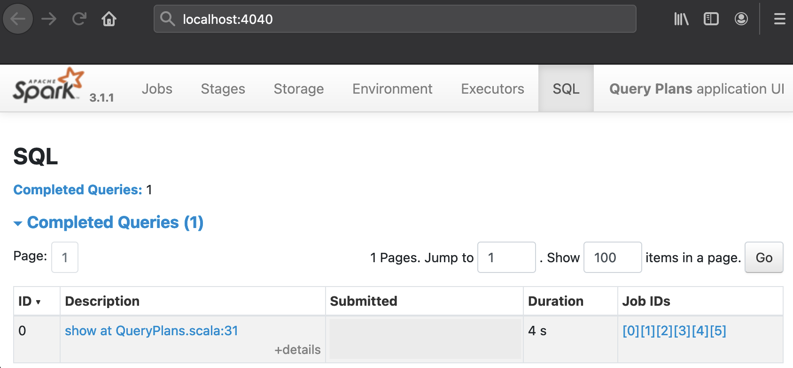
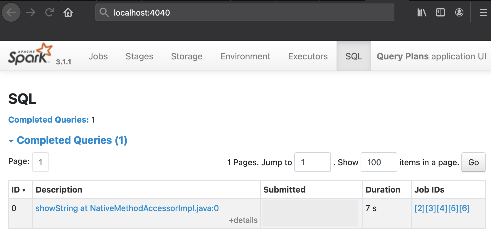
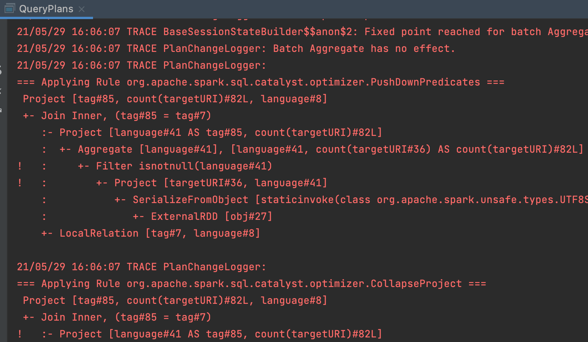

Made in London by [me](https://www.linkedin.com/in/phil-phil-439513182/) <br>
Back to the [index](https://g1thubhub.github.io/index.html) <br>


<br>
# §10.1 Query Plan Hermeneutics

The [previous article](https://g1thubhub.github.io/catalyst.html) has explained the Catalyst pipeline in detail. The following sections will focus on more practical aspects like the interpretion of Catalyst plans.

## Accessing Catalyst Plans
An artefact needs to be available before an interpretation can be attempted. The Catalyst plans that are depicted in the [pipeline diagram](https://g1thubhub.github.io/catalyst.html#the-catalyst-pipeline) can be programmatically accessed and therefore printed out: Scala users can call `.queryExecution.` on a DataFrame/Dataset object or SQL query followed by a plan name, the full references are mentioned in the bulleted list below. Pythonic DataFrames do not directly expose this functionality but a detour into the underlying Java object would likely work, so calling `._jdf.queryExecution().optimizedPlan()` on a Python DataFrame for example should provide a handle for the _Optimized Logical Plan_:
``` python
python_dataframe1 = spark.createDataFrame([('Value1', 1), ('Value2', 2)])
python_dataframe2 = spark.createDataFrame([('Value1', 11), ('Value3', 33)])
python_joined = python_dataframe1.join(python_dataframe2, '_1')
print(python_joined._jdf.queryExecution().optimizedPlan())
# Result:
# Project [_1#0, _2#1L, _2#5L]
# +- Join Inner, (_1#0 = _1#4)
#    :- Filter isnotnull(_1#0)
#    :  +- LogicalRDD [_1#0, _2#1L], false
#    +- Filter isnotnull(_1#4)
#       +- LogicalRDD [_1#4, _2#5L], false
```

The individual Catalyst plans can be programmatically accessed by using the following fields:  
- **Unresolved Logical Plan**: `.queryExecution.logical`
- **Analyzed) Logical Plan**: `.queryExecution.analyzed`
- **Analyzed Logical Plan with cached data**: `.queryExecution.withCachedData`
- **Optimized Logical Plan**: `.queryExecution.optimizedPlan`
- **Spark Plan**: `.queryExecution.sparkPlan`
- **Selected Physical Plan**: `.queryExecution.executedPlan`

<br>
A verbose string representation of all plans except the _Spark Plan_ is printed when calling `.explain(True)` in Python or `.explain(true)` in Scala on a DataFrame object. The shorter `.explain()` will just print the _Selected Physical Plan_. Both methods delegate to `explain(mode: String)` which defines three more formats. Therefore, the Catalyst plans can be conveniently printed in five different ways by passing the following String arguments to the `explain` utility method:
- _simple_: Print only the _Selected Physical Plan_
- _extended_: Print both logical and physical plans
- _codegen_: Print a physical plan and generated codes if they are available
- _cost_: Print a logical plan and plan node statistics if they are available
- _formatted_: Split explain output into two sections: A physical plan outline and node details

The snippets below use `explain("cost")` to print the _Optimized Logical Plan_ with statistics to the terminal:
```scala
// Scala
val df1 = spark.createDataset(Seq[(String, Int)](("Value1", 1), ("Value2", 2)))
val df2 = spark.createDataset(Seq[(String, Int)](("Value1", 11), ("Value3", 33)))
val joinedDf = df1.join(df2)
joinedDf.explain("cost")

/* Output:
== Optimized Logical Plan ==
Join Inner, Statistics(sizeInBytes=4.0 KiB)
:- LocalRelation [_1#2, _2#3], Statistics(sizeInBytes=64.0 B)
+- LocalRelation [_1#9, _2#10], Statistics(sizeInBytes=64.0 B)
*/
```

``` python
# Python
df1 = spark.createDataFrame([('Value1', 1), ('Value2', 2)])
df2 = spark.createDataFrame([('Value1', 11), ('Value3', 33)])
joined_df = df1.join(df2, '_1')
joined_df.explain('cost')

# Output:
# == Optimized Logical Plan ==
# Project [_1#0, _2#1L, _2#5L], Statistics(sizeInBytes=5.85E+37 B)
# +- Join Inner, (_1#0 = _1#4), Statistics(sizeInBytes=8.51E+37 B)
#    :- Filter isnotnull(_1#0), Statistics(sizeInBytes=8.0 EiB)
#    :  +- LogicalRDD [_1#0, _2#1L], false, Statistics(sizeInBytes=8.0 EiB)
#    +- Filter isnotnull(_1#4), Statistics(sizeInBytes=8.0 EiB)
#       +- LogicalRDD [_1#4, _2#5L], false, Statistics(sizeInBytes=8.0 EiB)
```

<br>
The Web UI can also be used for plan inspections: When a DataFrame/Dataset object or a SQL query are used in a program, a _SQL_ tab appears in the UI which ultimately leads to dedicated visualizations of the physical plans and a _Details_ section at the bottom with ASCII representations. The textual and graphical representation of the physical plans both have the shape of a DAG or, more precisely, of a tree whose nodes are constituted by operators. However, they have to be read in different ways, the next exercise will create such plans and a guidance on how to interpret them will be offered afterwards.


## Sources for interpretation
This practice segment focusses on viewing and then interpreting the Catalyst plans that are created internally whenever Spark SQL is used. The following programs combine two datasets, a small map that associates language codes with their English descriptions will be joined with the distribution of language codes in a corpus of web pages:

<br>
[QueryPlans.scala](https://github.com/g1thubhub/bdrecipes/blob/master/tutorials/module1/scala/QueryPlans.scala)
``` scala
package module1.scala
import org.apache.spark.rdd.RDD
import org.apache.spark.sql.functions.count
import org.apache.spark.sql.{DataFrame, SparkSession}
import module1.scala.utilities.WarcRecord
import module1.scala.utilities.HelperScala.{createSession, extractRawRecords, parseRawWarc}

object QueryPlans {
  def main(args: Array[String]): Unit = {
    val sampleLocation = if (args.nonEmpty) args(0) else "/Users/me/IdeaProjects/bdrecipes/resources/warc.sample" // ToDo: Modify path
    implicit val spark: SparkSession = createSession(3, "Query Plans")
    spark.sparkContext.setLogLevel("TRACE")
    import spark.implicits._

    val langTagMapping = Seq[(String, String)](("en", "english"), ("pt-pt", "portugese"), ("cs", "czech"), ("de", "german"),
    ("es", "spanish"), ("eu", "basque"), ("it", "italian"), ("hu", "hungarian"), ("pt-br", "portugese"), ("fr", "french"),
    ("en-US", "english"), ("zh-TW", "chinese"))
    val langTagDF: DataFrame = langTagMapping.toDF("tag", "language")

    val warcRecordsRdd: RDD[WarcRecord] = extractRawRecords(sampleLocation).flatMap(parseRawWarc)
    val warcRecordsDf: DataFrame = warcRecordsRdd.toDF()
      .select('targetURI, 'language)
      .filter('language.isNotNull)

    val aggregated = warcRecordsDf
      .groupBy('language)
      .agg(count('targetURI))
      .withColumnRenamed("language", "tag")

    val joinedDf: DataFrame = aggregated.join(langTagDF, Seq("tag"))

    joinedDf.show()
    joinedDf.explain(true)
    Thread.sleep(10L * 60L * 1000L) // Freeze for 10 minutes
  }
}
```
[query_plans.py](https://github.com/g1thubhub/bdrecipes/blob/master/tutorials/module1/python/query_plans.py)
``` python
import time
from sys import argv
from pyspark import RDD
from pyspark.sql import SparkSession, DataFrame
from pyspark.sql.functions import count, col
from tutorials.module1.python.utilities.helper_python import create_session, extract_raw_records, parse_raw_warc

if __name__ == "__main__":
    sample_location = (argv[0]) if len(argv) > 1 else '/Users/me/IdeaProjects/bdrecipes/resources/warc.sample'  # ToDo: Modify path
    spark: SparkSession = create_session(3, "Query Plans")
    spark.sparkContext.setLogLevel("TRACE")
    lang_tag_mapping = [('en', 'english'), ('pt-pt', 'portugese'), ('cs', 'czech'), ('de', 'german'), ('es', 'spanish'), 
    ('eu', 'basque'), ('it', 'italian'), ('hu', 'hungarian'), ('pt-br', 'portugese'), ('fr', 'french'), ('en-US', 'english'),
    ('zh-TW', 'chinese')]
    lang_tag_df: DataFrame = spark.createDataFrame(lang_tag_mapping, ['tag', 'language'])
    raw_records = extract_raw_records(sample_location, spark)
    warc_records_rdd: RDD = raw_records.flatMap(parse_raw_warc)
    warc_records_df: DataFrame = warc_records_rdd.toDF() \
        .select(col('target_uri'), col('language')) \
        .filter(col('language') != '')

    aggregated = warc_records_df \
        .groupBy(col('language')) \
        .agg(count(col('target_uri'))) \
        .withColumnRenamed('language', 'tag')

    joined_df = aggregated.join(lang_tag_df, ['tag'])

    joined_df.show()
    joined_df.explain(True)
    time.sleep(10 * 60)  # Freeze for 10 minutes
```

The following paragraphs explain the functional units of the code in more detail:

<br>
(1) Initially, a list of String pairs is declared that represents a mapping from language code to an English description. A DataFrame with two columns is then created from the list:
``` scala
// Scala
val langTagDF: DataFrame = langTagMapping.toDF("tag", "language")
```
The two arguments passed to `toDF` change the default column names (`_1` and `_2`) to the more user-friendly `tag` and `language`.
``` python
# Python
lang_tag_df: DataFrame = spark.createDataFrame(lang_tag_mapping, ['tag', 'language'])
```

(2) The second dataset consists of a DataFrame that is backed by an RDD of parsed `WarcRecord`s. Two fields are `select`ed for further processing, the URI and language code. If the language code is missing in a record/row, it is just skipped: 
``` scala
// Scala
val warcRecordsRdd: RDD[WarcRecord] = extractRawRecords(sampleLocation).flatMap(parseRawWarc)
val warcRecordsDf: DataFrame = warcRecordsRdd.toDF()
  .select('targetURI, 'language)
  .filter('language.isNotNull)
```

``` python
# Python
warc_records_rdd: RDD = raw_records.flatMap(parse_raw_warc)
warc_records_df: DataFrame = warc_records_rdd.toDF() \
  .select(col('target_uri'), col('language')) \
  .filter(col('language') != '')
```

(3) The next snippet calculates the distribution of language tags that `warcRecordsDf` holds by grouping the website dataset on the URI field.

``` scala
// Scala
val aggregated = warcRecordsDf
  .groupBy('language)
  .agg(count('targetURI))
  .withColumnRenamed("language", "tag")
```

``` python
# Python
aggregated = warc_records_df \
  .groupBy(col('language')) \
  .agg(count(col('target_uri'))) \
  .withColumnRenamed('language', 'tag')
```


(4) Both DataFrames can now be `join`ed on their tag column:

``` scala
// Scala
val joinedDf: DataFrame = aggregated.join(langTagDF, Seq("tag"))
```

``` python
# Python
joined_df = aggregated.join(lang_tag_df, ['tag'])
```

(5) Finally, the rows of the joined DataFrame are printed via `show`. More importantly, the Catalyst plans are also printed out and the program is frozen for a few minutes which leaves enough time to explore the WebUI:

``` scala
// Scala
joinedDf.show()
joinedDf.explain(true)
Thread.sleep(10L * 60L * 1000L) // Freeze for 10 minutes
```

``` python
# Python
joined_df.show()
joined_df.explain(True)
time.sleep(10 * 60)  # Freeze for 10 minutes
```

## Program Results
After running the programs, a textual representation of the joined DataFrame should be part of the console output. The table consists of a header and a dozen "data rows": 

```
+-----+----------------+---------+
|  tag|count(targetURI)| language|
+-----+----------------+---------+
|   en|               5|  english|
|pt-pt|               1|portugese|
|   cs|               1|    czech|
|   de|               1|   german|
|   es|               4|  spanish|
|   eu|               1|   basque|
|   it|               1|  italian|
|   hu|               1|hungarian|
|pt-br|               1|portugese|
|   fr|               1|   french|
|en-US|               6|  english|
|zh-TW|               1|  chinese|
+-----+----------------+---------+
```

But this result is of secondary importance here, we will focus on Catalyst’s operations. Thanks to `joinedDf.explain(true)`, the plans should also have been printed out in an ASCII tree format. The relevant console outputs are pasted in the following dedicated pages:
- [Catalyst plans](https://g1thubhub.github.io/CatalystPlansScala.txt) for QueryPlans.scala
- [Catalyst plans](https://g1thubhub.github.io/CatalystPlansPython.txt) for query_plans.py

During the execution of the Spark jobs, a _SQL_ tab should appear on the Web UI. The result is computed quickly in a matter of seconds but the final `sleep` statements in the programs keep the UI alive for 10 minutes so there is enough time for exploration. The _SQL_ tab should show the following _Completed Queries_:



<br>

The table will look slightly different in the PySpark run:
<br>

<br>

The URL next to Query ID 0, [show at QueryPlans.scala:31](https://g1thubhub.github.io/twoplans.html) or [showString at NativeMethodAccessorImpl.java:0](https://g1thubhub.github.io/twoplans.html) for PySpark, points to a drawing of the _Selected Physical Plan_ whose textual representation is also included at the bottom of the respective pages. The plans that Catalyst compiles for QueryPlans.scala and query_plans.py have a similar, bifurcated shape. Snapshots of the graphical representations are juxtaposed on this [dedicated page](https://g1thubhub.github.io/twoplans.html). The next paragraphs discusses various aspects of these plans in more detail:

## Interpretation Guidelines
<br>
In general, the textual representations have to be read from "bottom to top", but the UI visualizations should be interpreted in the reverse direction: The programs used in this article have two inputs, a source RDD backed by an input file and a source DataFrame wrapping the dozen entries from the in-memory list `langTagMapping`, this results in a bifurcated physical plan. In the Spark UI [drawings](https://g1thubhub.github.io/twoplans.html), the source collections are represented as rectangles at the top of the two branches, they are labelled `Scan (number of output rows: 3,001)` and `LocalTableScan (number of output rows: 12)`. Their names are slightly different in the PySpark case, namely `Scan ExistingRDD`. In every textual tree, these data source operators are placed at the bottom of the branches and every operator name (like `Scan` or `Scan ExistingRDD`) is prefixed by a `+-` or `:-` character sequence. By contrast, operation names are printed in bold face at the top of light blue rectangles in graphical trees.

<br>
Let’s have a closer look at the branch that originates from the text file: After the file scan, Catalyst inserted a sequence of operations prior to shuffling the records, among them were a `Filter`, a `Project`, and a `HashAggregate` / `Exchange` / `HashAggregate` triple. The semantics of the `Filter` op is obvious and directly corresponds to the `.filter('language.isNotNull)` (Python: `.filter(col('language') != '')`) line in the source code. The `Project` is a fancy term denoting the selection of specific fields/columns and occurs because we selected the URL and language fields of web page records in the text file. The subsequent operation trio was created by the computation of the language tag frequency: This aggregation triggered a shuffle which is associated with the `Exchange` node. It is surrounded by `HashAggregate`s because Spark performed a partial count on each executor to reduce the shuffle size: If the three records _<en,1>_, _<en,1>_ and _<en,1>_ are created within the same partition, they get merged into a single pair _<en,3>_ before being shuffled to the target partition in which the global count can be determined. The [textual](https://g1thubhub.github.io/CatalystPlansScala.txt) representation of the _Physical [Plan](https://g1thubhub.github.io/CatalystPlansPython.txt)_ indicates this nicely with the expression `keys=[language#41], functions=[partial_count(targetURI#36)]`, a pop-up with the same contents will appear on the UI when the mouse is hovered over the first `HashAggregate` box.

<br>
Eventually, the branch we just partially traversed flows into the `BroadcastHashJoin` node (PySpark: `SortMergeJoin`) where it meets the other branch that originated from the in-memory language map. As their labels alrready indicate, the `BroadcastHashJoin`/`SortMergeJoin` boxes correspond to the `.join` operation in the source code which combines the two datasets so there is only a single dataflow branch onwards. The labels are different in the Scala and Python runs because Catalyst picked different shuffle algorithms, the decision is based on factors like data sizes involved etc.

<br>
Upon closer inspection, there is something strange about the operation order described in the previous paragraphs: In the source code of the two programs as well as in the _Parsed_ and _Analyzed Logical Plan_, the `.select` occurs before the `.filter` whereas in the _Optimized Logical_ and _Physical Plan_, this order is reversed. We have not encountered a bug but witnessed the application of a Catalyst optimization that pulled a filter "forward" with the intention of reducing the amount of data that needs to be processed. This is also confirmed by the logging output which contain the line `=== Applying Rule org.apache.spark.sql.catalyst.optimizer.PushDownPredicates ===` along with half a dozen messages from other optimization rules that fired:

<br>


<br>
It is also noteworthy that the UI displays a few large dark blue boxes labelled `WholeStageCodeGen` which often encompass several operators in small light blue rectangles. They are drawn whenever the generated Java code for the enclosed operators was fused together into a single function unit which increases the efficiency. In the textual form of the physical plan, this is reflected by an asterisk followed by the id of the CodeGen stage like `+- *(1) Filter isnotnull(language#39)`. Not every node can be surrounded by `WholeStageCodeGen` boxes (asterisks) because more "complicated" operators like an `Exchange` or custom aggregations are beyond the scope of this optimization technique.

<br>
For some operators like `HashAggregate`, additional metric quantities like spill sizes are displayed on the UI so it provides a treasure trove of information about the execution of a Spark program that can greatly help with identifying its bottleneck(s). Much more could be written about and learned from query plans, this section only attempts to cover the basics. It is an excellent idea for the reader to spend more time studying the different plans of the programs used in this article on his or her own. And the exercise in the [next article](https://g1thubhub.github.io/hermeneutics2.html) should be completed of course.