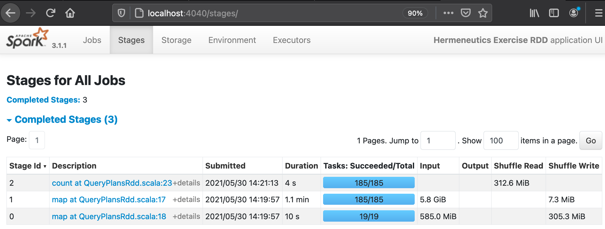
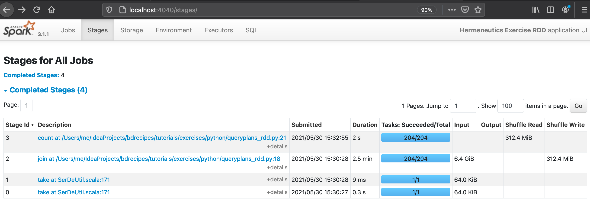
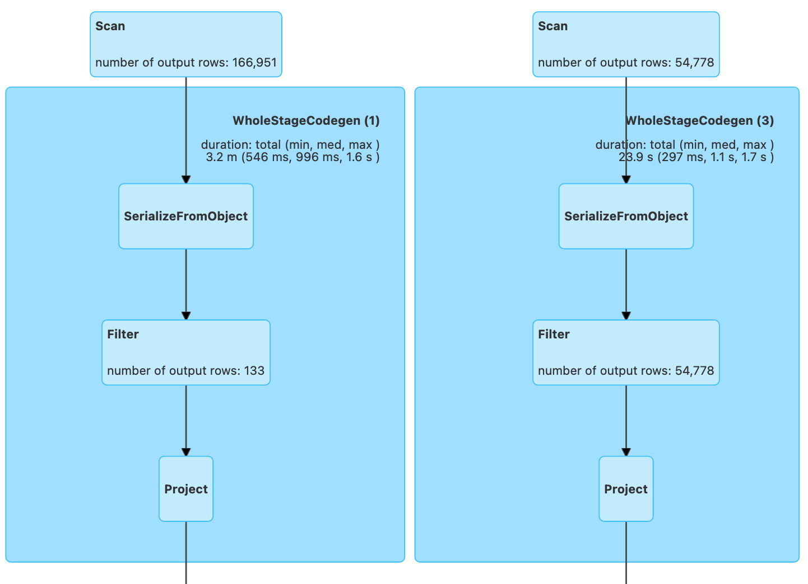
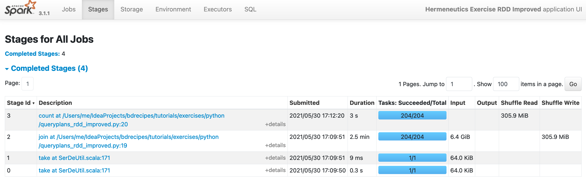

Made in London by [me](https://www.linkedin.com/in/phil-phil-439513182/) <br>
Back to the [index](https://g1thubhub.github.io/index.html) <br>


<br>
# §10.2 Query Plan Exercises

## Source Programs

The starting point for this exercise are two programs, [QueryPlansRdd.scala](https://github.com/g1thubhub/bdrecipes/blob/master/tutorials/exercises/scala/QueryPlansRdd.scala) and [queryplans_rdd.py](https://github.com/g1thubhub/bdrecipes/blob/master/tutorials/exercises/python/queryplans_rdd.py). Their logic is implemented in the RDD API and contains a twist in the form of a very inefficient part:

<br>
[QueryPlansRdd.scala](https://github.com/g1thubhub/bdrecipes/blob/master/tutorials/exercises/scala/QueryPlansRdd.scala)
``` scala
package exercises.scala

import org.apache.spark.rdd.RDD
import org.apache.spark.sql.{DataFrame, SparkSession}
import module1.scala.utilities.{WarcRecord, WetRecord}
import module1.scala.utilities.HelperScala.{createSession, extractRawRecords, parseRawWarc, parseRawWet}

object QueryPlansRdd {
  def main(args: Array[String]): Unit = {
    val inputLocWarc = if (args.nonEmpty) args(0) else "/Users/me/IdeaProjects/bdrecipes/resources/
    CC-MAIN-20191013195541-20191013222541-00000.warc" // ToDo: Modify path
    val inputLocWet = if (args.nonEmpty) args(1) else "/Users/me/IdeaProjects/bdrecipes/resources/
    CC-MAIN-20191013195541-20191013222541-00000.warc.wet" // ToDo: Modify path
    implicit val spark: SparkSession = createSession(3, "Hermeneutics Exercise RDD")

    val warcRecords: RDD[WarcRecord] = extractRawRecords(inputLocWarc).flatMap(parseRawWarc)
    val wetRecords: RDD[WetRecord] = extractRawRecords(inputLocWet).flatMap(parseRawWet)

    val pairWarc: RDD[(String, Option[String])] = warcRecords.map(warc => (warc.targetURI, warc.language))
    val pairWet: RDD[(String, String)] = wetRecords.map(wet => (wet.targetURI, wet.plainText))

    val joined: RDD[(String, (Option[String], String))] = pairWarc.join(pairWet)
    val spanishRecords = joined.filter(_._2._1.contains("es"))

    println(s"@@ Result: ${spanishRecords.count()}") // 133
    Thread.sleep(10L * 60L * 1000L) // For exploring WebUI
  }
}
```

[queryplans_rdd.py](https://github.com/g1thubhub/bdrecipes/blob/master/tutorials/exercises/python/queryplans_rdd.py)
``` python
import time
from sys import argv
from pyspark import RDD
from pyspark.sql import SparkSession, DataFrame
from tutorials.module1.python.utilities.helper_python import create_session, extract_raw_records, parse_raw_warc, parse_raw_wet

if __name__ == "__main__":
    input_loc_warc = (argv[1]) if len(argv) > 2 else '/Users/me/IdeaProjects/bdrecipes/resources/
    CC-MAIN-20191013195541-20191013222541-00000.warc'  # ToDo: Modify path
    input_loc_wet = (argv[2]) if len(argv) > 2 else '/Users/me/IdeaProjects/bdrecipes/resources/
    CC-MAIN-20191013195541-20191013222541-00000.warc.wet'  # ToDo: Modify path
    spark: SparkSession = create_session(3, 'Hermeneutics Exercise RDD')

    warc_records: RDD = extract_raw_records(input_loc_warc, spark).flatMap(lambda record: parse_raw_warc(record))
    wet_records: RDD = extract_raw_records(input_loc_wet, spark).flatMap(lambda record: parse_raw_wet(record))

    pair_warc: RDD = warc_records.map(lambda warc: (warc.target_uri, warc.language))
    pair_wet: RDD = wet_records.map(lambda wet: (wet.target_uri, wet.plain_text))

    joined = pair_warc.join(pair_wet)
    spanish_records = joined.filter(lambda triple: triple[1][0] == 'es')

    print('@@ Result: ' + str(spanish_records.count()))  # 133
    time.sleep(10 * 60)  # For exploring WebUI
```

The program input consists of two text files, namely _CC-MAIN-20191013195541-20191013222541-00000.warc_ and _CC-MAIN-20191013195541-20191013222541-00000.warc.wet_.
These are the full versions of the web corpus samples that are included in the bdrecipes codebase. The [prologue article](https://g1thubhub.github.io/intro-code#the-common-crawl-corpus) explains how the full files can be downloaded. 

## Tasks
The following tasks should be completed:  <br>
(a) Study the source code and explain what it does <br>
(b) Identify the inefficiency and in the programs  <br>
(c) Collect metric values about the inefficiency from the WebUI, for example how much data was read and written during the stages  <br>
(d) Convert the programs into equivalent DataFrame versions without trying to "fix" the logic yet  <br>
(e) Run the new programs, study the query plans, and collect data  <br>
(f) Improve the code of the RDD and DataFrame versions  <br>
(g) Rerun the programs and validate if any improvements occurred  <br>
(h) Use the knowledge gained from the previous two chapters to explain your observations <br>


## Solution steps
(1) The corpus files are parsed and pair RDDs get created: Both RDDs get keyed on their URL field but their second elements differ, the language field constitutes the value for WARC records whereas the text field becomes the second element in the case of WET records. Then the pair RDDs get joined on their URL which results in triples consisting of the URL, the language, and the text of a webpage. Finally, a filter is applied which skips any records that do not have a Spanish language field and the number of these records is printed to the console. 

<br>
(2) The major inefficiency in the logic is the placement of the filter: It occurs too late, after all WARC records were parsed and joined with the WET RDD. The join triggers a shuffle which moves many irrelevant non-Spanish records across partitions (and across machines through the network in the case of clustered apps) which is an expensive operation. Pulling the filter "forward" and applying it right after parsing the WARC records should significantly reduce the data size in downstream computations. 

<br>
(3) Replace the paths to the input files in inputLocWarc and inputLocWet with the appropriate locations and run the program. 

<br>
(4) After a few minutes of processing time, the Web UI (http://localhost:4040/stages/) should display the following read/write sizes for the three completed stages:

<br>
After the execution of [QueryPlansRdd.scala](https://github.com/g1thubhub/bdrecipes/blob/master/tutorials/exercises/scala/QueryPlansRdd.scala):


<br>
After the execution of [queryplans_rdd.py](https://github.com/g1thubhub/bdrecipes/blob/master/tutorials/exercises/python/queryplans_rdd.py):


<br>
(5) If the Spark session is still active because of the `.sleep` invocation, the program should be manually terminated. Now the DataFrame versions can be created by cloning the source files [QueryPlansRdd.scala](https://github.com/g1thubhub/bdrecipes/blob/master/tutorials/exercises/scala/QueryPlansRdd.scala) / [queryplans_rdd.py](https://github.com/g1thubhub/bdrecipes/blob/master/tutorials/exercises/python/queryplans_rdd.py) and renaming them, suitable candidates are _QueryPlansDataFrame.sala_ and _queryplans_dataframe.py_ . The name of the object in the Scala source should match the filename and the the application name passed to `createSession` should be changed from "Hermeneutics Exercise RDD" to "Hermeneutics Exercise DataFrame"

<br>
(6) The _pairWarc_ and _pairWet_ RDD declarations have to be replaced with the following segments that create equivalent DataFrames.

<br>
[QueryPlansDataFrame.sala](https://github.com/g1thubhub/bdrecipes/blob/master/tutorials/exercises/scala/QueryPlansDataFrame.scala):
```scala
import spark.implicits._
val warcRecordsDf: DataFrame = warcRecords.toDF.select("targetURI", "language")
val wetRecordsDf: DataFrame = wetRecords.toDF.select("targetURI", "plainText")
```

[queryplans_dataframe.py](https://github.com/g1thubhub/bdrecipes/blob/master/tutorials/exercises/python/queryplans_dataframe.py):
``` python
from pyspark.sql.functions import col
warc_records_df: DataFrame = warc_records.toDF().select(col('target_uri'), col('language'))
wet_records_df: DataFrame = wet_records.toDF().select(col('target_uri'), col('plain_text'))
```

<br>
(7) The subsequent `join` and `filter` need to be rewritten in the following way while the last two statements can remain the same:

<br>
[QueryPlansDataFrame.sala](https://github.com/g1thubhub/bdrecipes/blob/master/tutorials/exercises/scala/QueryPlansDataFrame.scala):
``` scala
val joinedDf = warcRecordsDf.join(wetRecordsDf, Seq("targetURI"))
val spanishRecords = joinedDf.filter('language === "es")
```

[queryplans_dataframe.py](https://github.com/g1thubhub/bdrecipes/blob/master/tutorials/exercises/python/queryplans_dataframe.py):
``` python
joined_df = warc_records_df.join(wet_records_df, ['target_uri'])
spanish_records = joined_df.filter(col('language') == 'es')
```

<br>
(8) The shuffle read/write sizes for the DataFrame editions decrease significantly: The two stage that processes the two input files now write less than 5MiB instead of more than 300MiB in the the screenshots above which is quite astonishing:

<br>
After the execution of [QueryPlansDataFrame.sala](https://github.com/g1thubhub/bdrecipes/blob/master/tutorials/exercises/scala/QueryPlansDataFrame.scala):


<br>
After the execution of [queryplans_dataframe.py](https://github.com/g1thubhub/bdrecipes/blob/master/tutorials/exercises/python/queryplans_dataframe.py):


<br>
(9) The query plan can be viewed by clicking on the _SQL_ tab in the Spark UI and then on the `count` link in the _Completed Queries_ table. The top portion of the plan drawings reveals another surprise:

<br>
Top of the physical plan for [QueryPlansDataFrame.sala](https://github.com/g1thubhub/bdrecipes/blob/master/tutorials/exercises/scala/QueryPlansDataFrame.scala):



<br>

Top of the physical plan for [queryplans_dataframe.py](https://github.com/g1thubhub/bdrecipes/blob/master/tutorials/exercises/python/queryplans_dataframe.py):


<br>
Even though the `filter`s are placed near the end of the source code, the drawings show that a filtering operation was performed very close to the data sources: In both UI screenshots, the left rectangles visualize the parsing of the web corpus and 166,951 elements are apparently processed. However, a `Filter` box occurs right after `SerializaFromObject` / `Scan Existing RDD` and indicates that only 133 records (the Spanish webpages) survived the filter. When the mouse pointer is moved over the light blue `Filter` box on the actual UI, a small window should open whose contents prove that the filter in question does indeed apply the `'language === "es"` expression.


## Code Improvements
(10) Now it's time to improve the code of [QueryPlansRdd.scala](https://github.com/g1thubhub/bdrecipes/blob/master/tutorials/exercises/scala/QueryPlansRdd.scala) and [queryplans_rdd.py](https://github.com/g1thubhub/bdrecipes/blob/master/tutorials/exercises/python/queryplans_rdd.py): The language filter should be applied as soon as possible, right after the creation of the `pairWarc` RDD:

<br>
[QueryPlansRddImproved.scala](https://github.com/g1thubhub/bdrecipes/blob/master/tutorials/exercises/scala/QueryPlansRddImproved.scala)
```scala
val pairWarc: RDD[(String, Option[String])] = warcRecords.map(warc => (warc.targetURI, warc.language))
  .filter(_._2.contains("es"))
```

[queryplans_rdd_improved.py](https://github.com/g1thubhub/bdrecipes/blob/master/tutorials/exercises/python/queryplans_rdd_improved.py)
``` python
pair_warc: RDD = warc_records.map(lambda warc: (warc.target_uri, warc.language)) \
  .filter(lambda warc: warc[1] == 'es')
```

(11) The last four lines of [QueryPlansRdd.scala](https://github.com/g1thubhub/bdrecipes/blob/master/tutorials/exercises/scala/QueryPlansRdd.scala) / [queryplans_rdd.py](https://github.com/g1thubhub/bdrecipes/blob/master/tutorials/exercises/python/queryplans_rdd.py) need to be changed to:

<br>
[QueryPlansRddImproved.scala](https://github.com/g1thubhub/bdrecipes/blob/master/tutorials/exercises/scala/QueryPlansRddImproved.scala)

```scala
val joined: RDD[(String, (Option[String], String))] = pairWarc.join(pairWet)
println(s"@@ Result: ${joined.count()}") // 133
Thread.sleep(10L * 60L * 1000L)
```

[queryplans_rdd_improved.py](https://github.com/g1thubhub/bdrecipes/blob/master/tutorials/exercises/python/queryplans_rdd_improved.py)
``` python
joined = pair_warc.join(pair_wet)
print('@@ Result: ' + str(joined.count()))  # 133
time.sleep(10 * 60)  # For exploring WebUI
```


 (12) Taking the quantities in the screenshots of step (4) as baselines, the shuffle sizes for both new programs should decrease: Only around 29 KiB of temporary files are now created after the processing stage of the WARC file, down from 7.3 MiB (_Stage Id 1_) during the previous execution in step (4). In the PySpark run, the two input parsing stages are not listed separately on the UI but we can still see that the "composite" shuffle write dropped from 312.4 MiB to 305.9 MiB (_Stage Id 2_):  

<br>
After executing [QueryPlansRddImproved.scala](https://github.com/g1thubhub/bdrecipes/blob/master/tutorials/exercises/scala/QueryPlansRddImproved.scala):


<br>
After executing [queryplans_rdd_improved.py](https://github.com/g1thubhub/bdrecipes/blob/master/tutorials/exercises/python/queryplans_rdd_improved.py):



<br>
(12)  We can now try to improve the DataFrame editions ([QueryPlansDataFrame.scala](https://github.com/g1thubhub/bdrecipes/blob/master/tutorials/exercises/scala/QueryPlansDataFrame.scala) / [queryplans_dataframe.py](https://github.com/g1thubhub/bdrecipes/blob/master/tutorials/exercises/python/queryplans_dataframe.py)) along similar lines: Pulling the filter forward changes the `warcRecordsDf` creation to:

<br>
[QueryPlansDataFrameImproved.scala](https://github.com/g1thubhub/bdrecipes/blob/master/tutorials/exercises/scala/QueryPlansDataFrameImproved.scala):
```scala
val warcRecordsDf: DataFrame = warcRecords.toDF.select("targetURI", "language")
  .filter('language === "es")
```

<br>
[queryplans_dataframe_improved.py](https://github.com/g1thubhub/bdrecipes/blob/master/tutorials/exercises/python/queryplans_dataframe_improved.py):
``` python
warc_records_df: DataFrame = warc_records.toDF().select(col('target_uri'), col('language')) \
  .filter(col('language') == 'es')

```

(13) The final four lines in the original DataFrame code need to be replaced by the following three:

<br>
[QueryPlansDataFrameImproved.scala](https://github.com/g1thubhub/bdrecipes/blob/master/tutorials/exercises/scala/QueryPlansDataFrameImproved.scala):
```scala
val joinedDf = warcRecordsDf.join(wetRecordsDf, Seq("targetURI"))
println(s"@@ Result: ${joinedDf.count()}") // 133
Thread.sleep(1000L * 60L * 100L) // For exploring WebUI
```

[queryplans_dataframe_improved.py](https://github.com/g1thubhub/bdrecipes/blob/master/tutorials/exercises/python/queryplans_dataframe_improved.py):
``` python
joined_df = warc_records_df.join(wet_records_df, ['target_uri'])
print('@@ Result: ' + str(joined_df.count()))  # 133
time.sleep(10 * 60)  # For exploring WebUI
```


(14) However, the source code changes will not have a meaningful impact this time: When executing [QueryPlansDataFrameImproved.scala](https://github.com/g1thubhub/bdrecipes/blob/master/tutorials/exercises/scala/QueryPlansDataFrameImproved.scala) /
[queryplans_dataframe_improved.py](https://github.com/g1thubhub/bdrecipes/blob/master/tutorials/exercises/python/queryplans_dataframe_improved.py), the read/write sizes of the stages in the improved DataFrame programs will be identical to step (8) so the manual rearrangement did not have a similar positive effect as in steps (10) and (11).


<br>
We have just witnessed the power of the Catalyst optimizer in action: When using the DataFrames API, Spark is smart enough to figure out that the filter is applied too late in the code and "pushes it down" which means that it travels upwards in the _Optimized Logical Plan_, closer to the data source. Since this optimization is already performed internally by Catalyst, the code changes in steps (13) & (14) does not have an effect. By contrast, the manual filter rearrangement in (10) & (11) do lead to an improvement for the RDD scenario which shows us that a developer has to be more concerned about “how” the computation is performed when using the RDD API whereas the DataFrame/Dataset API is more declarative and its users can focus more on "what" they want to compute. An [upcoming article](https://g1thubhub.github.io/index.html) will explain the reasons for the better performance of the DataFrame programs in more detail.

<br>
Various programs were written during this exericse, here is a list of pointers to the source code for all of them:
- [QueryPlansRdd.scala](https://github.com/g1thubhub/bdrecipes/blob/master/tutorials/exercises/scala/QueryPlansRdd.scala) and [queryplans_rdd.py](https://github.com/g1thubhub/bdrecipes/blob/master/tutorials/exercises/python/queryplans_rdd.py)
- [QueryPlansDataFrame.sala](https://github.com/g1thubhub/bdrecipes/blob/master/tutorials/exercises/scala/QueryPlansDataFrame.scala) and [queryplans_dataframe.py](https://github.com/g1thubhub/bdrecipes/blob/master/tutorials/exercises/python/queryplans_dataframe.py)
- [QueryPlansRddImproved.scala](https://github.com/g1thubhub/bdrecipes/blob/master/tutorials/exercises/scala/QueryPlansRddImproved.scala) and [queryplans_rdd_improved.py](https://github.com/g1thubhub/bdrecipes/blob/master/tutorials/exercises/python/queryplans_rdd_improved.py)
- [QueryPlansDataFrameImproved.scala](https://github.com/g1thubhub/bdrecipes/blob/master/tutorials/exercises/scala/QueryPlansDataFrameImproved.scala) and [queryplans_dataframe_improved.py](https://github.com/g1thubhub/bdrecipes/blob/master/tutorials/exercises/python/queryplans_dataframe_improved.py)