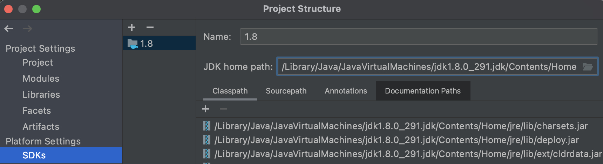
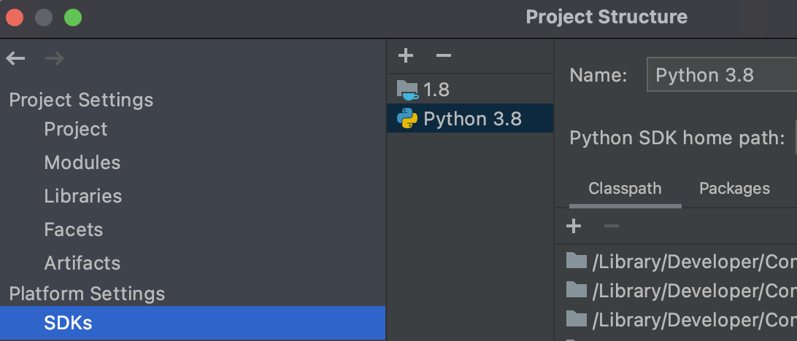
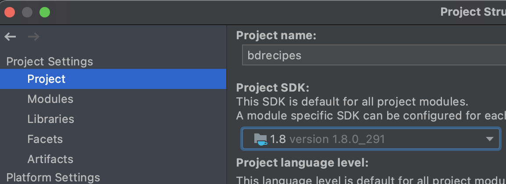
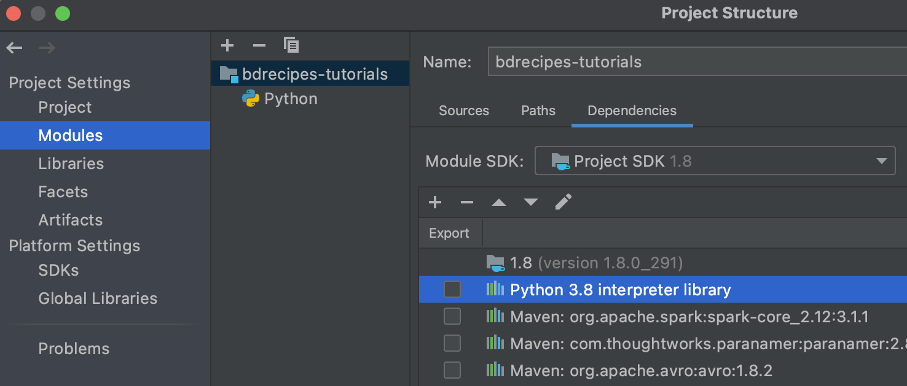
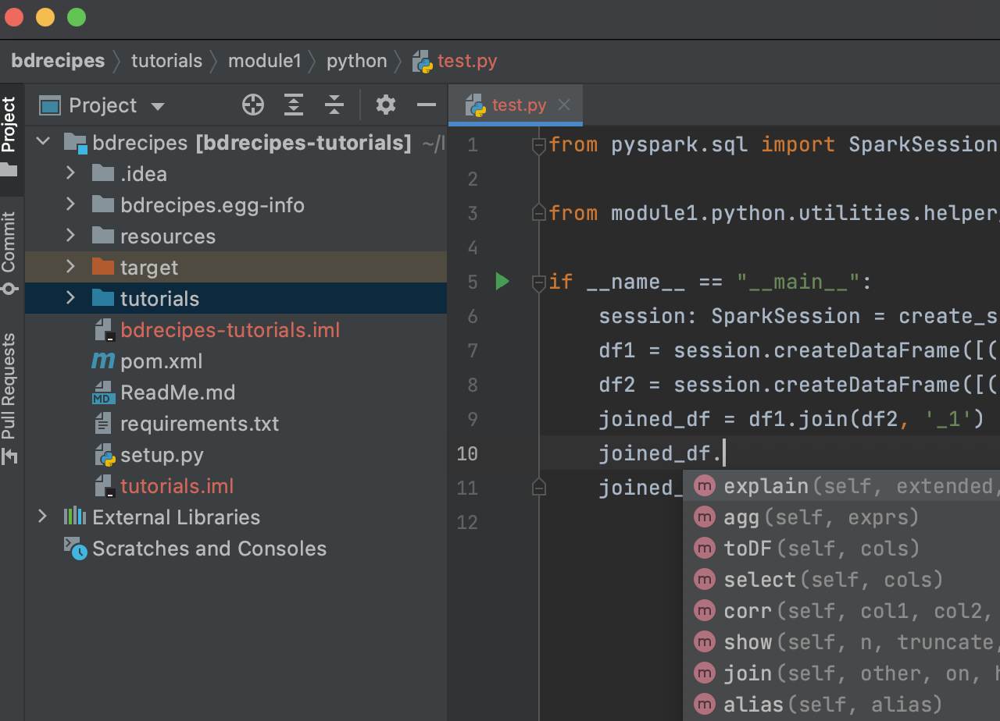

Made in London by [me](https://www.linkedin.com/in/phil-phil-439513182/) 

<br>


# §0.1 Preamble: The bdrecipes code base 

<br>
**Work in progress**

## Installing _bdrecipes_

The _bdrecipes_ project can be downloaded from [https://github.com/g1thubhub/bdrecipes](https://github.com/g1thubhub/bdrecipes):
``` shell
% cd IdeaProjects
% git clone https://github.com/g1thubhub/bdrecipes.git
  Cloning into 'bdrecipes'...
  remote: Enumerating objects: 72, done.
  remote: Total 72 (delta 0), reused 0 (delta 0), pack-reused 72
  Receiving objects: 100% (72/72), 41.66 MiB | 752.00 KiB/s, done.
  Resolving deltas: 100% (16/16), done.
```

Similar to Apache Spark, _bdrecipes_ uses Maven as build tool. When using **Scala**/**Java**, the project can be built with the command `mvn clean install`. A "fat JAR" file should have been compiled and placed in the `target` directory resulting in the location _target/bdrecipes-phil.jar_:
```shell
% cd bdrecipes
% pwd
    /Users/me/IdeaProjects/bdrecipes
% mvn clean install
  [...]
  [INFO] ------------------------------------------------------------------------
  [INFO] BUILD SUCCESS
  [INFO] ------------------------------------------------------------------------
  [INFO] Total time:  41.957 s
  [INFO] Finished at: 2021-05-30
  [INFO] ------------------------------------------------------------------------

% ls target 
  bdrecipes-phil.jar
``` 

The **Python**/**Pyspark** functionality of bdrecipes becomes available after the package is installed with a command like `pip3 install -e .` , for example
``` shell
% pwd
    /Users/me/IdeaProjects/bdrecipes
% pip3 install -e .
    Obtaining file:///Users/me/IdeaProjects/bdrecipes
    Installing collected packages: bdrecipes
      Found existing installation: bdrecipes 0.0.0
        Uninstalling bdrecipes-0.0.0:
          Successfully uninstalled bdrecipes-0.0.0
      Running setup.py develop for bdrecipes
    Successfully installed bdrecipes
```

The project can now be opened with an IDE like IntelliJ by clicking on `File` // `Open` and navigating to the root directory that was created by `git clone`(e.g., _~/IdeaProjects/bdrecipes_).

## Setting up IntelliJ with (Py)Spark
Several modifications should be made when a development environment like IntelliJ is used for writing and running Spark programs. Most importantly, IntelliJ needs to be configured with the correct Java and Python runtimes. This can be easily done in the _Project Structure_ window which opens after clicking on `File` // `Project Structure`. In the `Platform Settings` // `SDKs` tab on the left hand side, the runtimes can be hooked up with the `+` symbol. IntelliJ might have already auto-detected the correct runtimes in which case they would appear at the end of the list. If the list is blank or if the wrong version was detected (e.g., Python 2), the SDKs can be manually added: 
- For specifying the JDK, click on `+` // `Add JDK` and navigate to the base path of the right Java runtime, for example _/Library/Java/JavaVirtualMachines/jdk1.8.0_291.jdk_
- The Python 3 SDK can be specified by clicking on `+` // `Add Python SDK` which opens an _Add Python Interpreter_ window with several environment options on the left side. Picking the `System Interpreter` option (e.g., _/usr/bin/python3_) is not recommended, a virtual environment should be preferred for Python.

After applying the previous steps, the SDKs should be correctly set up: 



<br>
After adding the Python SDK:



<br>

These SDKs can now be used for the _bdrecipes_ project: In the _Project Structure_ window (`File` // `Project Structure`), the Java JDK should be selected in the `Project SDK` list under the `Project Settings` // `Project` tab:



Finally, the Python SDK for _bdrecipes_ can be picked by navigating to `Project Settings` // `Modules`, clicking on the `+` symbol and selecting `Python`. The final module layout should be similar to the following shapshot:




<br>
These setup steps are a bit tedious but they will pay off: We can now write and execute multilingual Spark programs inside the IntelliJ sandbox and additional functionality like code completion and dot operator support becomes available even for PySpark:




## Inputs
The input to most programs developed in subsequent articles are text files whose content resides in the public domain. The input files are compressed and placed in the [resources](https://github.com/g1thubhub/bdrecipes/tree/master/resources) folder so they need to be unzipped before Spark jobs can consume them. _warc.sample_ and _wet.sample_ are samples of a large web corpus which is described in more detail below:  

### The Common Crawl Corpus
The [Common Crawl organization](https://commoncrawl.org) harvests the World Wide Web and, thanks to the partnership with AWS’s Open Data [program](https://registry.opendata.aws), makes the result of their monthly crawls publicly available. Statistics and index files for the October 2019 crawl archive for example can be found [here](https://commoncrawl.s3.amazonaws.com/crawl-data/CC-MAIN-2019-43/index.html). Common Crawl uses three formats for different subsets of the crawled raw data. Only two of those, the _WebArchive_ (WARC) and _WebExtracredText_ (WET) formats, are relevant for the next articles, the content in the skipped format is mostly metadata-oriented.

<br>
The two links [warc.paths.gz](https://commoncrawl.s3.amazonaws.com/crawl-data/CC-MAIN-2019-43/warc.paths.gz) and [wet.paths.gz](https://commoncrawl.s3.amazonaws.com/crawl-data/CC-MAIN-2019-43/wet.paths.gz) on the crawl archive page mentioned above lead to download locations for the WARC and WET files for October 2019. Each index file contains 56000 lines and each line represents a URL fragment that points to a gzipped file which contains a subset of the dataset. This means that the entire crawled content for the month of October is distributed across 56000 files. To obtain a valid URL, the lines need to be prefixed by `https://commoncrawl.s3.amazonaws.com/` or `s3://commoncrawl/`. For example, the full download paths for the first WARC and WET files from the first line of the corresponding index/path files would be
<br>
[https://commoncrawl.s3.amazonaws.com/crawl-data/CC-MAIN-2019-43/segments/1570986647517.11/warc/CC-MAIN-20191013195541-20191013222541-00000.warc.gz](https://commoncrawl.s3.amazonaws.com/crawl-data/CC-MAIN-2019-43/segments/1570986647517.11/warc/CC-MAIN-20191013195541-20191013222541-00000.warc.gz) <br>
[https://commoncrawl.s3.amazonaws.com/crawl-data/CC-MAIN-2019-43/segments/1570986647517.11/wet/CC-MAIN-20191013195541-20191013222541-00000.warc.wet.gz](https://commoncrawl.s3.amazonaws.com/crawl-data/CC-MAIN-2019-43/segments/1570986647517.11/wet/CC-MAIN-20191013195541-20191013222541-00000.warc.wet.gz)

<br>
Two samples drawn from each of these files is included in the [resources](https://github.com/g1thubhub/bdrecipes/tree/master/resources) folder of the _bdrecipes_ project:
- [warc.sample](https://github.com/g1thubhub/bdrecipes/blob/master/resources/warc.sample.zip) consists of the first 3000 recods of _CC-MAIN-20191013195541-20191013222541-00000.warc_
- [wet.sample](https://github.com/g1thubhub/bdrecipes/blob/master/resources/wet.sample.zip) consists of the first 3000 recods of _CC-MAIN-20191013195541-20191013222541-00000.warc.wet_
