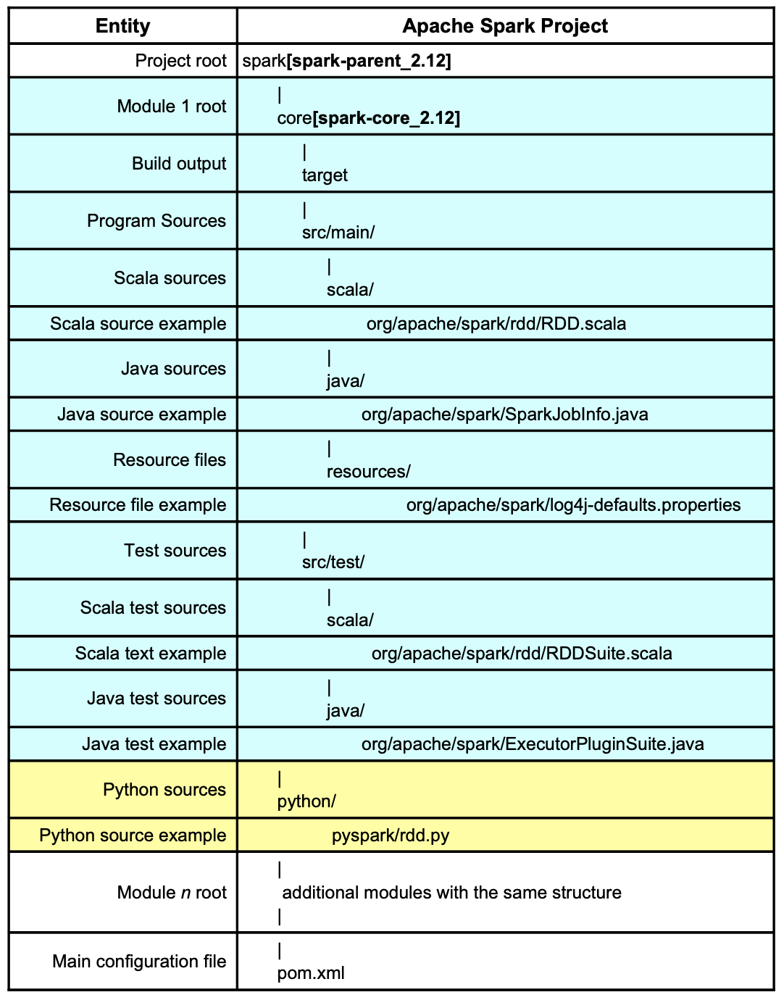

Made in London by [me](https://www.linkedin.com/in/phil-phil-439513182/)  
Back to the [index](https://g1thubhub.github.io/index.html)  

 

# §0.2 Preamble: Setting up Apache Spark

 
**Work in progress**

## Getting Spark and PySpark

**Work in progress**
[...] 

 

Surprisingly, pretty much everything should work out of the box on macOS Big Sur: The default Python version is still Python 2 but a warning message recommends to "transition to using 'python3' from within Terminal". On my system, this `python3` is preinstalled and located at `/usr/bin/python3`, a path suitable to be used as value for _Python Interpreter_ in IntelliJ (see below). Only three additional dependencies were required for running Spark jobs locally:
- A Spark 3.1.1 release pre-built for Hadoop 3.2 which can be downloaded from the official Spark [homepage](https://spark.apache.org/downloads.html). After unpacking, the contents of the file reside in `/Users/me/spark-3.1.1-bin-hadoop3.2` on my system which is the path to which the environment variable `SPARK_HOME` should point to.
- For executing PySpark programs locally, the `pyspark` package should be installed with a command like `pip3 install pyspark`. 
- When using IntelliJ, the Scala and Python plugins should be installed.

From my personal experience, various problems can occur when executing Spark programs and using IntelliJ as a development environment. A few remarks that might be helpful for troubled readers:
- Spark 3.1.1 is mostly written in Scala 2.12.10 which is indicated by the presence of `scala-compiler-2.12.10.jar` in `spark-3.1.1-bin-hadoop3.2/jars`. To avoid conflicts, Scala 2.11 should be used for sources that are executed with the Spark 2 line (except for Spark 2.4.2) but Scala 2.12 is the version of choice for Spark 3. A mismatch in Scala versions can result in program crashes. The dbrecipes project avoids clashes by defining the congruent property pair `<spark.version>3.1.1</spark.version>` and `<scala.version>2.12.10</scala.version>` in its [POM file](https://github.com/g1thubhub/bdrecipes/blob/4d2ad51e75647008d13104077773aa022e9073c0/pom.xml#L11).

[...]

## Spark's modular structure

Apache Spark's primary build tool is [Maven](https://maven.apache.org) and many Maven projects follow a similar hierarchical layout:

 
More than two dozen subdirectories can be found under the root directory **spark**, a testament to the complexity of and functionalities shipped with Apache Spark. IntelliJ marks a directory that coincides with a module root by a small cyan rectangle followed, in bold face, by the module's name surrounded by brackets. The layout of these modules is similar to **core[spark-core_2.12]** whose internal structure is described in more detail in table 1 by the rows with a pale green background.

 
For a developer, the following directories/modules have a special significance: 
- bin: Contains launch scripts, used in Chapter 3 onwards
- conf: Location for configuration file that have an effect when Spark is launched via scripts from the bin directory mentioned above. All files are just templates and "disabled" by default
- **core[spark-core_2.12]**: Contains code for core functionality and the older RDD API
- **mllib[spark-mllib_2.12]**: Machine Learning module
- python: Home of Python/PySpark related code, explored in more detail [here]()
- **streaming[spark-streaming_2.12]**: Streaming module
- sql: Directory for modules relating to the newer Dataset API and SQL:
  * **catalyst[spark-catalyst_2.12]**: Code for Spark's query optimizer which is described in detail [here]()
  * **core[spark-sql_2.12]**: Home of Dataset API and SQL interface

In the first articles of this tutorial, we will executed code mostly uses functionality from the **core[spark-core_2.12]** module, in particular the classes located under the _org.apache.spark.rdd_ package. For SQL queries and the newer DataFrame/Dataset APIs, the packages under _spark-sql_ will be heavily utilized.

## Support docs
