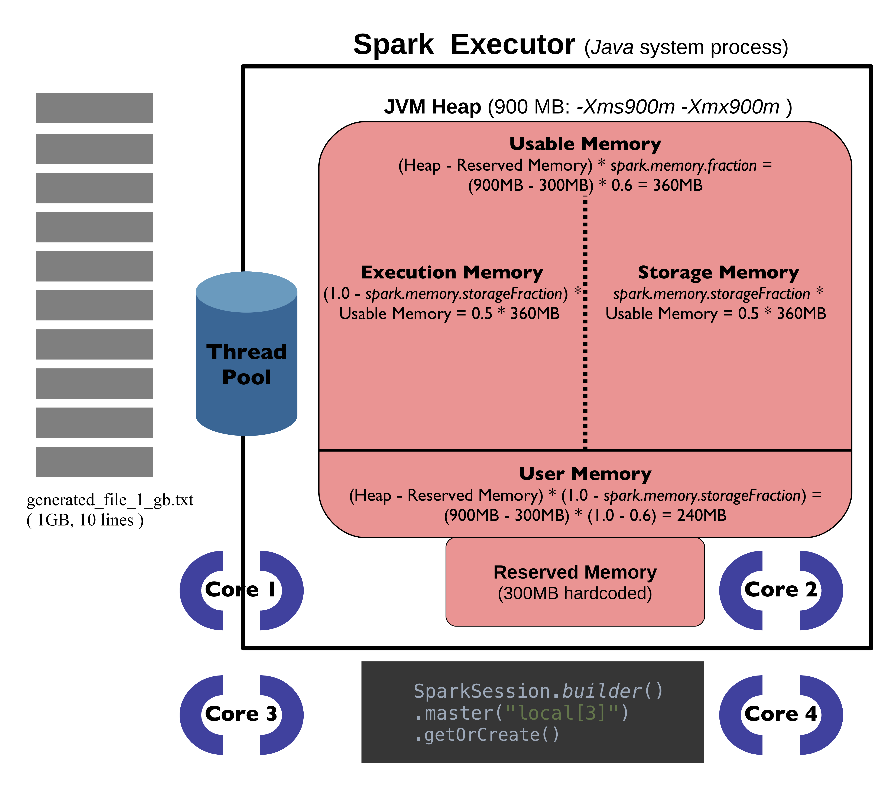
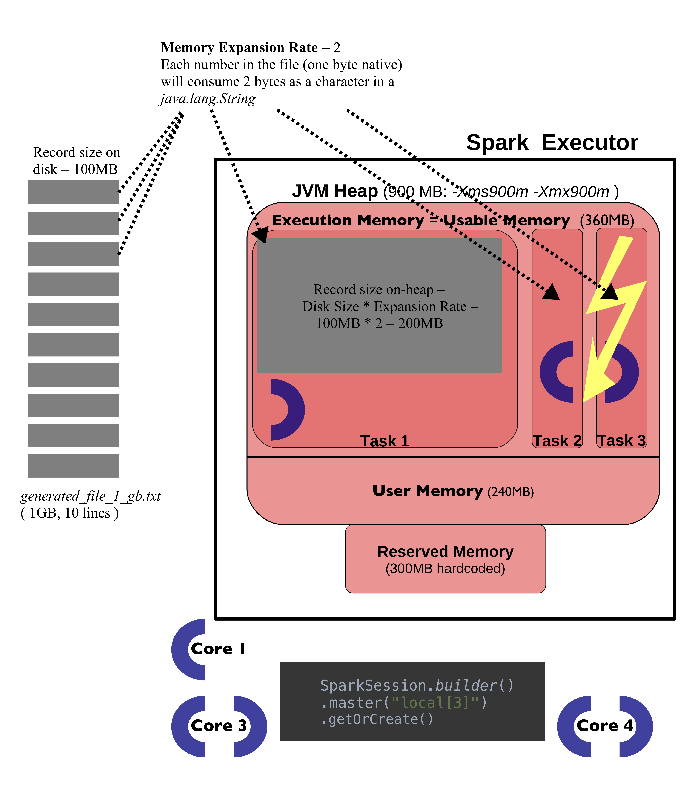
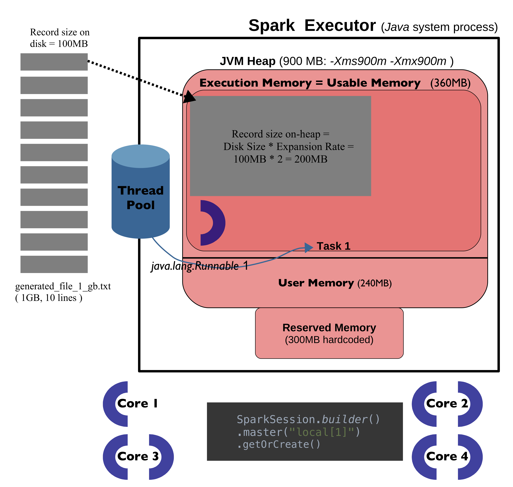
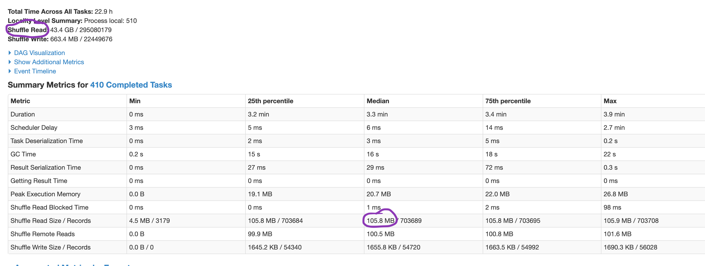

Made in London by writingphil@gmail.com

# Apache Spark and memory
## Memory mysteries
 
I recently read an excellent blog series about Apache Spark but [one article](https://www.waitingforcode.com/apache-spark/apache-spark-data-bigger-than-memory/read ) caught my attention as its author states:
>Let's try to figure out what happens with the application when the source file is much bigger than the available memory. The memory in the below tests is limited to 900MB [...]. Naively we could think that a file bigger than available memory will fail the processing with OOM memory error. And this supposition is true:

It would be bad if Spark could only process input that is smaller than the available memory -- in a distributed environment, it implies that an input of 15 Terabytes in size could only be processed when the number of Spark executors multiplied by the amount of memory given to each executor equals at least 15TB. I can say from experience that this is fortunately not the case so let's investigate the example from the article above in more detail and see why an _OutOfMemory_ exception occured.

 
The input to the failed Spark application used in the article referred to above is a text file (_generated_file_1_gb.txt_) that is created by a script similar to [this](https://github.com/g1thubhub/bdrecipes/blob/master/src/main/java/spark/fractions/prepare_input.py). This file is 1GB in size and has ten lines, each line simply consists of a line number (starting with zero) that is repeated 100 million times. The on-disk-size of each line is easy to calculate, it is one byte for the line number multipled by 100 million or ~100MB. The [program](https://github.com/g1thubhub/bdrecipes/blob/master/src/main/java/spark/fractions/ProcessFile.scala) that processes this file launches a local Spark executor with three cores and the memory available to it is limited to 900MB as the JVM arguments _-Xms900m -Xmx900m_ are used. This results in an OOM error after a few seconds so this little experiment seems to validate the initial hypothesis that "we can't process datasets bigger than the memory limits".

 
I played around with the Python script that created the original input file [here](https://github.com/g1thubhub/bdrecipes/blob/master/src/main/java/spark/fractions/phil_prepare.py) and ... 
(-) created a second input file that is twice the disk size of the original (_generated_file_1_gb.txt_) but will be processed successfully by [ProcessFile.scala](https://github.com/g1thubhub/bdrecipes/blob/master/src/main/java/spark/fractions/ProcessFile.scala)  
(-) switched to the DataFrame API instead of the RDD API which again crashes the application with an OOM Error  
(-) created a third file that is less than a third of the size of _generated_file_1_gb.txt_ but that crashes the original application  
(-) reverted back to the original input file but made one small change in the application code wich now processes it successfully (using `.master("local[1]")`)  
The first and last change directly contradict the original hypothesis and the other changes make the memory mystery even bigger. 

## Memory compartments explained
 
Visualizations will be useful for illuminating this mystery, the following pictures show Spark's memory compartments when running [ProcessFile.scala](https://github.com/g1thubhub/bdrecipes/blob/master/src/main/java/spark/fractions/ProcessFile.scala) on my MacBook:

According to the system spec, my MacBook has four physical cores that amount to eight vCores. Since the application was initializd with `.master("local[3]")`, three out of those eight virtual cores will participate in the processing. As reflected in the picture above, the JVM heap size is limited to 900MB and default values for both `spark.memory.` fraction properties are used. The sizes for the two most important memory compartments from a developer perspective can be calculated with these formulas:

 
**Execution Memory** = (1.0 - _spark.memory.storageFraction_)  *  Usable Memory = 0.5 * 360MB = 180MB  
**Storage Memory** =  _spark.memory.storageFraction_  *  Usable Memory          = 0.5 * 360MB = 180MB

 
*Execution Memory* is used for objects and computations that are typically short-lived like the intermediate buffers of shuffle operation whereas *Storage Memory* is used for long-lived data that might be reused in downstream computations. However, there is no static boundary but an eviction policy -- if there is no cached data, then Execution Memory will claim all the space of Storage Memory and vice versa. If there is stored data and a computation is performed, cached data will be evicted as needed up until the Storage Memory amount which denotes a minimum that 
will not be spilled to disk. The reverse does not hold true though, execution is never evicted by storage.

 
The example application does not cache any data so Execution Memory will eat up all of Storage Memory but this is still not enough:

We can finally see the root cause for the application failure and the culprit is not the total input size but the individual record size: Each record consists of 100 million numbers (0 to 9) from which a _java.lang.String_ is created. The size of such a String is twice its "native" size (each character consumes 2 bytes) plus some overhead for headers and fields which amortizes to a **Memory Expansion Rate** of 2. As already mentioned, the Spark Executor processing the text file uses three cores which results in three tasks trying to load the first three lines of the input into memory at the same time. Each active task gets the same chunk of Execution Memory (360MB), thus
 
**Execution Memory per Task** = (Usable Memory  - Storage Memory) / _spark.executor.cores_
							  = (360MB - 0MB) / 3 = 360MB / 3 = 120MB    
Based on the previous paragraph, the memory size of an input record can be calculated by   
**Record Memory Size** = Record size (disk) * Memory Expansion Rate    
= 100MB * 2 = 200MB   
... which is significantly above the available _Execution Memory per Task_ hence the observed application failure.

Assigning just one core to the Spark executor will prevent the _Out Of Memory_ exception as shown in the following picture:

Now there is only one active task that can use all Execution Memory and each record fits comfortably into the available space since 200MB < < 360MB. This defeats the whole point of using Spark of course since there is no parallelism, all records are now processed consecutively. 

  
 With the formulas developed above, we can estimate the largest record size which would not crash the original version of the application (which uses `.master("local[3]")`): We have around 120MB per task available so any record can only consume up to 120MB of memory. Given our special circumstances, this implies that each line in the file should be 120/200 = 0.6 times shorter. I created a slightly modified [script](https://github.com/g1thubhub/bdrecipes/blob/master/src/main/java/spark/fractions/phil_prepare.py#L32) that creates such a maximum input, it uses a factor of 0.6 and the resulting file can still be processed without an OOM error. Using a factor of 0.7 though would create an input that is too big and crash the application again thus validating the thoughts and formulas developed in this section.

## Going distributed: Spark inside YARN containers
Things become even more complicated in a distributed environment. Suppose we run on AWS/EMR and use a cluster of _m4.2xlarge_ instance types, then every node has eight vCPUs (four physical CPUs) and 32GB memory according to [https://aws.amazon.com/ec2/instance-types/](https://aws.amazon.com/ec2/instance-types/). YARN will be responsible for resource allocations and each Spark executor will run inside a YARN container.  Additional memory properties have to be taken into acccount since YARN needs some resources for itself:

Out of the 32GB node memory in total of an _m4.2xlarge_ instance, 24GB can be used for containers/Spark executors by default (property _yarn.nodemanager.resource.memory-mb_) and the largest container/executor could use all of this memory (property _yarn.scheduler.maximum-allocation-mb_), these values are taken from [https://docs.aws.amazon.com/emr/latest/ReleaseGuide/emr-hadoop-task-config.html](https://docs.aws.amazon.com/emr/latest/ReleaseGuide/emr-hadoop-task-config.html). Each YARN container needs some overhead in addition to the memory reserved for a Spark executor that runs inside it, the default value of this _spark.yarn.executor.memoryOverhead_ property is 384MB or 0.1 * Container Memory, whichever value is bigger; the memory available to the Spark executor would be 0.9 * Container Memory in this scenario.

 
How is this _Container Memory_ determined? It is actually not a property that is explicitly set: Let's say we use two Spark executors and two cores per executor (_--executor-cores 2_) as reflected in the image above. Then the Container Memory is  
**Container Memory** = _yarn.scheduler.maximum-allocation-mb_ / Number of Spark executors per node
= 24GB / 2 = 12GB

Therefore each Spark executor has 0.9 * 12GB available (equivalent to the _JVM Heap_ sizes in the images above) and the various memory compartments inside it could now be calculated based on the formulas introduced in the first part of this article. The virtual core count of two was just chosen for this example, it wouldn't make much sense in real life since four vcores are idle under this configuration. The best setup for _m4.2xlarge_ instance types might be to just use one large Spark executor with seven cores as one core should always be reserved for the Operating System and other background processes on the node.

## Memory and partitions in real life workloads
Determining the "largest" record that might lead to an OOM error is much more complicated than in the previous scenario for a typical workload: The line lengths of all input files used (like _generated_file_1_gb.txt_) were the same so there was no "smallest" or "largest" record. Finding the maximum would be much harder if not practically impossible when transformations and aggregations occur. One approach might consist in searching the input or intermediate data that was persisted to stable storage for the "largest" record and creating an object of the right type (the schema used during a bottleneck like a shuffle) from it. The memory size of this object can then be directly determined by passing a reference to `SizeEstimator.estimate`, a version of this function that can be used outside of Spark can be found [here](https://github.com/g1thubhub/datastructurezoo/blob/master/src/main/scala/memmeasure/spark/JvmSizeEstimator.scala).

  
Once an application succeeds, it might be useful to determine the **average memory expansion rate** for performance reasons as this could influence the choice of the number of (shuffle) partitions: One of the clearest indications that more partitions should be used is the presence of "spilled tasks" during a shuffle stage. In that case, the Spark Web UI should show two spilling entries (_Shuffle spill (disk)_ and _Shuffle spill (memory)_) with positive values when viewing the details of a particular shuffle stage by clicking on its _Description_ entry inside the _Stage_ section. The presence of these two metrics indicates that not enough Execution Memory was available during the computation phase so records had to be evicted to disk, a process that is bad for the application performance. A "good" side effect of this costly spilling is that the memory expansion rate can be easily approximated by dividing the value for _Shuffle spill (memory)_ by _Shuffle spill (disk)_ since both metrics are based on the same records and denote how much space they take up in-memory versus on-disk, therefore:   
**Memory Expansion Rate** ≈ Shuffle spill (memory) / Shuffle spill (disk)

 
This rate can now be used to approximate the total in-memory shuffle size of the stage or, in case a Spark job contains several shuffles, of the biggest shuffle stage. An estimation is necessary since this value is not directly exposed in the web interface but can be inferred from the on-disk size (field _Shuffle Read_ shown in the details view of the stage) multiplied by the Memory Expansion Rate:  
**Shuffle size in memory** = Shuffle Read * Memory Expansion Rate

 
Finally, the number of shuffle partitions should be set to the ratio of the Shuffle size (in memory) and the memory that is available per task, the formula for deriving the last value was already mentioned in the first section ("Execution Memory per Task"). So  
**Shuffle Partition Number** = Shuffle size in memory /  Execution Memory per task  
This value can now be used for the configuration property _spark.sql.shuffle.partitions_ whose default value is 200 or, in case the RDD API is used, for _spark.default.parallelism_ or as second argument to operations that invoke a shuffle like the _*byKey_ functions.

 
The intermediate values needed for the last formula might be hard to determine in practice in which case the following alternative calculation can be used; it only uses values that are directly provided by the Web UI: The _Shuffle Read Size_ per task for the largest shuffle stage should be around 150MB so the number of shuffle partitions would be equal to the value of _Shuffle Read_ divided by it:  
**Shuffle Partition Number** = Shuffle size on disk (= Shuffle Read) / 150 

 

  
