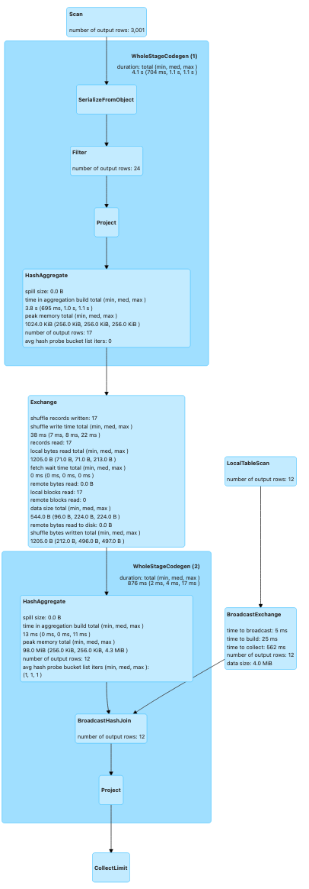
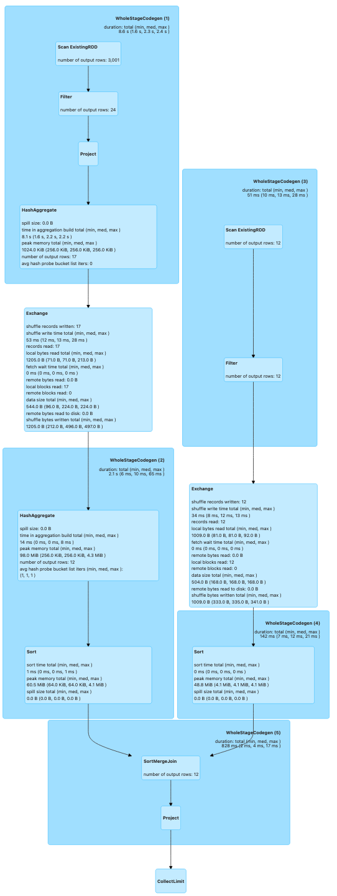

Made in London by [me](https://www.linkedin.com/in/phil-phil-439513182/)
Back to the [index](https://g1thubhub.github.io/index.html) 
 
 
 
 
Drawings for the physical plans of the [hermeneutics article](https://g1thubhub.github.io/hermeneutics.html):

 

Physical Plan for [QueryPlans.scala](https://github.com/g1thubhub/bdrecipes/blob/master/tutorials/module1/scala/QueryPlans.scala):
 

 
 
 
 
Physical Plan for [query_plans.py](https://github.com/g1thubhub/bdrecipes/blob/master/tutorials/module1/python/query_plans.py):
 
